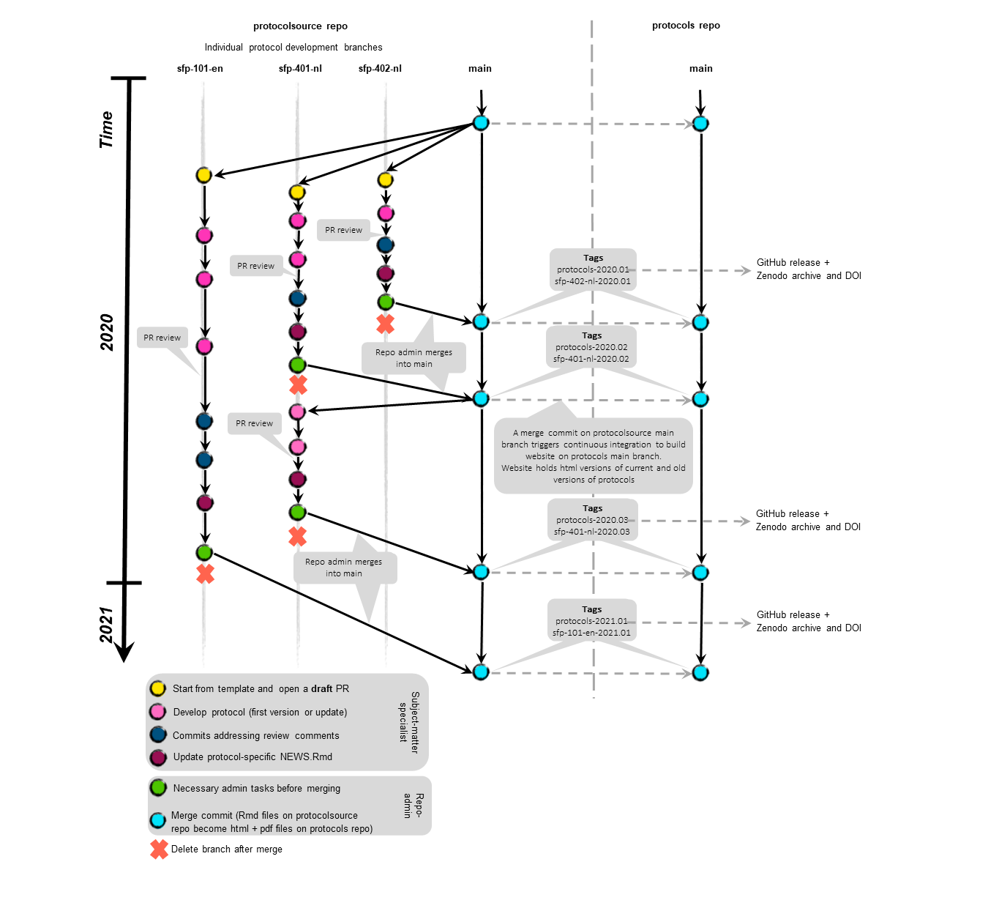

## Welcome!

Thank you for considering to contribute to this repository!

## Setup your local repository

Are you a first-time GitHub user?
Make sure you can authenticate to GitHub by following [these guidelines](https://inbo.github.io/tutorials/tutorials/git_authentication/).

Installing the repository on your local drive:

-   go to the [protocolsource repository](https://github.com/inbo/protocolsource/) and press the green `Code` button
-   select HTTPS and copy the URL to the clipboard
-   start RStudio and select `File -> New project -> Version Control -> Git` -\> paste the URL
-   `protocolsource` will be automatically suggested as project directory name (keep it that way)
-   In the field `Create project as subdirectory of` select a folder on your local disc. For instance `C:/R/repositories`.
-   Click "Create project"

You will now have a local clone of the remote repository as an RStudio project.
The `.git` directory is used by the version control system (do not make changes in this directory).

The same directories and files which can be seen on the [remote](https://github.com/inbo/protocolsource) will be copied to your local drive.
Whenever you want to work in the project, you need to open `protocolsource.Rproj` file to start the RStudio project.

## `renv` R package management

This RStudio project uses [renv](https://rstudio.github.io/renv/articles/renv.html) to manage R package dependencies.
This ensures that different users have the same versions of packages installed.
See also [collaborating with renv](https://rstudio.github.io/renv/articles/collaborating.html).
The first time you open the RStudio project `renv` should automatically download and install the appropriate version of `renv` into the project library.
After this has completed, you can use `renv::restore()` to restore the R packages in the local project library on your machine.

In case you need another package than the ones installed (see the [DESCRIPTION file](DESCRIPTION)) for this project, ask one of the admins to do this for you.
It is not allowed to do this in a [protocol-specific branch](#branching).
Note also that any dependency packages needed by the packages listed in the [DESCRIPTION file](DESCRIPTION) are also available in the project and they are listed in [the lock file](renv.lock).

## Installation of TinyTeX

Apart from the above R packages, you will also need a working installation of TinyTeX, which is an external open-source software package that is needed to render protocols to PDF format (i.e. when you run `protocolhelper::render_protocol()` see [Workflow](#workflow)).

To install this:

-   close the RStudio project and any other R sessions and start the most recent version of R that is installed on your system

-   follow the [installation instructions](https://github.com/inbo/INBOmd/#installation) provided by the `INBOmd` R package and copy-paste the installation instructions in the R console.

## `(R)markdown` syntax and learning `Rmarkdown`

This repository contains the source documents of protocols.
These source documents are written in `Rmarkdown` language, which is a combination of a simple markup language and code written in chunks.

RStudio has both a `source` mode and a [`visual` mode](https://rstudio.github.io/visual-markdown-editing/) to work with these kind of documents.
The `source` mode is a plain text file, whereas the `visual` mode is a WYSIWYG editor mode which will be more familiar to Microsoft-Word users.
The RStudio project associated with the `protocolsource` repository is configured to use [`canonical visual mode markdown`](https://rstudio.github.io/visual-markdown-editing/markdown.html#canonical-mode) in source mode at project level.
This setting ensures that the same markdown syntax is written to disc no matter if you edited the document in `source` mode or in `visual` mode.
For instance, you could write an unordered list in markdown as follows in source mode:

```
* item 1
* item 2
```

When you press save - due to the canonical mode setting - this will be automatically changed to:

```
-   item 1
-   item 2
```

Similarly, html comments that span multiple lines will be wrapped in a html block:

```
<!--
A html comment spanning
multiple lines
-->
```

becomes:

````
```{=html}
<!--
A html comment spanning
multiple lines
-->
```
````

So, if you see such _odd_ changes upon saving a markdown document in `source` mode, or after using the `visual` mode: don't panic!
There is no need to try undoing these changes, they will not change how the protocol is rendered (if it does, you discovered a bug and should write an issue for the RStudio developers).
The `visual` mode has some nice features to work with [citations in Rmarkdown](https://inbo.github.io/tutorials/tutorials/r_citations_markdown/), especially if you use Zotero as a reference manager.
These features are (currently) not available in `source` mode.

Another project-level setting that we use is `sentence wrapping`.
This means that each sentence will start at a new line when you save your markdown document.
To start a new paragraph, a blank line is needed.

Some useful resources for self-learning of `Rmarkdown`:

-   [rmarkdown book](https://bookdown.org/yihui/rmarkdown/)
-   [bookdown book](https://bookdown.org/yihui/bookdown/)
-   [tutorial rmarkdown](https://ourcodingclub.github.io/2016/11/24/rmarkdown-1.html)

In RStudio:

-   `Help -> Markdown Quick Reference`
-   `Help -> Cheatsheets -> R markdown cheatsheet`

Tips & Tricks:

-   `ctrl + alt + i`: insert R chunk

-   select lines of R code in an R chunk followed by `ctrl-alt-i` puts the selected lines in a new R chunk

-   chunk options: <https://yihui.name/knitr/options/>

-   chunk names: are optional but recommended especially if an output is generated by the chunk, do not use spaces or \_ in chunk names (e.g. \`\`\`r name-of-chunk)

-   use 1 chunk for 1 (ggplot) figure or 1 table or other type of output that is printed

-   To refer to files, each template already contains an R object in the `index.Rmd` file that refers to the protocol path:
    ```r
    library(protocolhelper)
    path_to_protocol <- get_path_to_protocol(rmarkdown::metadata$protocol_code)
    ```
    You can use this in combination with `file.path()` to refer to files (e.g. `r file.path(path_to_protocol, "media", "image1.png"`)

-   Use `knitr::include_graphics()` to insert `png`, `jpg`, ... files that you put into the `media` folder of the protocol

-   If you want to make cross-reference to tables or figures use the following syntax.
    This is explained in [the Components chapter of the bookdown book](https://bookdown.org/yihui/bookdown/components.html#components):
    
    -   Figure `\@ref(fig:chunk_name)`
    
    -   Table `\@ref(tab:chunk_name)`

-   In case your protocol contains video material, do not store the video in the `media` folder, but publish it on the INBO vimeo channel and embed them following the instructions given [here](https://bookdown.org/yihui/rmarkdown/learnr-videos.html).

## <a name="branching"></a>Branching model



We use a simple branching model.
The main branch is protected and can only receive commits from reviewed pull requests.
Development of a protocol (see [Workflow](#workflow)) is done in a protocol-specific branch that branches off the main branch.
The name of the protocol-specific branch should be equal to the protocol-code.

Protocols can depend on other protocols (protocol dependencies) only if these dependency protocols have been approved (and are published).
Circular dependencies are not allowed.

Whenever a pull request is reviewed, approved and finalized, a repo-admin will merge the branch to the main and add general and specific tags (see [release model](README.md#release-model)).
Note that the merge commit to which these tags are attached represents an entire snapshot of the complete repository - not only the part of the repository that refers to the specific protocol.

Each time a merge commit is made to the main branch of the `protocolsource` repo, a 'mirror read-only' repository (`protocols` repo) will be automatically triggered to build the rendered html versions of the protocols using GitHub Actions.
The resulting website is hosted at https://inbo.github.io/protocols/.
This website will host all approved and published versions of all protocols.

## Workflow

### <a name="workflow-new"></a>Adding a **new** protocol

1.  Make sure your local clone of the remote repository is up to date:

    1.  with the main branch checked out, press the pull button in the RStudio Git pane

2.  A subject-matter specialist uses `protocolhelper::create_protocol()` (or one of its shortcut functions `create_sfp()` or `create_spp()`) to start a new [protocol from a template](#from-a-new-template)

3.  The generated protocol-code (e.g. `sfp-406-nl`) is noted and a new branch named after the protocol-code is created:

    1.  in the Console type `checklist::new_branch(branch = "<protocol-code>")` (replace <protocol-code> by the generated protocol-code, e.g. `sfp-406-nl`)

4.  The template files contain instructions which explain what information needs to be added in that particular section. These instructions are placed inside html-chunks as html comments and will not be visible in the rendered version of the protocol. Add your text outside of these html-chunks. 

5.  After some work on the protocol, a first commit is made, i.e. the (developing) protocol state is stored by the version control system:

    1.  make sure the protocol branch is up to date with the main branch: open the Git shell and type `git pull origin main`
    2.  stage the files generated from the template in the git pane
    3.  press commit button and add a commit message
    4.  press the commit button
    5.  press the push button (or postpone pushing until several commits have been made)

6.  Continue work on the protocol

    0.  make sure the protocol branch is up to date with the main branch: open the Git shell and type `git pull origin main`

    1.  See [What to do in case of parameterized protocols?](#parameterized)
        for specific guidelines about parameterizing parts of a protocol

    2.  See [What to do in case of dependencies?](#dependencies)
        for how to declare protocol dependencies and adding them as subprotocols

    3.  See [What to do in case of translations?](#translations)
        for guidance about translations of protocols

    4.  Use `protocolhelper::check_frontmatter("<protocol-code>")` to check for issues in the frontmatter of your `index.Rmd` file.
        Fix any issues found.

    5.  Regurlarly use `protocolhelper::check_structure("<protocol-code>")` to check for issues regarding the structure of your protocol.
        Fix any issues found.

    6.  Regularly preview the html and pdf versions of the protocol:

        1.  with `protocolhelper::render_protocol("<protocol-code>")` (when this function is finished, read the message in the R console after "Output created: ..." to see where you can find and preview the rendered version of your protocol).

    7.  add text, media, references, ... to the Rmarkdown files

    8.  save your changes

    9.  stage, commit, push changes


7.  When you think your protocol is ready to be reviewed, visit [github protocolsource](https://github.com/inbo/protocolsource) and start a Pull Request (PR)

    

    

   1. Wait for the continuous integration checks to finish and see if the checks succeeded.
   These checks will run `protocolhelper::check_frontmatter()` and `protocolhelper::check_structure()`, and update the version number if needed.
   In case there are problems with the YAML front matter of your `index.Rmd` file or problems with the structure of the protocol not conforming to the protocol templates, these problems will be listed and can be consulted.
   
       1.  Address the problems detected by `protocolhelper::check_frontmatter` or `protocolhelper::check_structure`. You can see the list of problems by clicking on the check online (at the bottom of the pull request webpage). Alternatively, you can run these functions locally and see the list of problems printed in your console.
        Note that during this automatic run, a commit to update the version number may be automatically pushed to the remote.
        If this commit is added, press pull in the RStudio Git Pane to add it to your local clone
       
       1.  iterate (stage, commit, push changes) until the functions detect no problems
   
   1. Add reviewers.
    At least one repo admin and one other subject-matter specialist must review the protocol.
    The subject-matter specialist reviews the contents of the protocol and the repo-admin reviews technical aspects.
    To give reviewers access to the rendered version of the protocol, you zip the rendered files and upload them online in the conversation space of your pull request.

    

10.  Reviewers can follow [these guidelines](REVIEWING.md)

11. If the reviewers raise concerns, changes can be made to the protocol that address these concerns (stage, commit, push).
    If the review requires substantial changes, it is wise to temporarilly mark the PR as draft

    

    When you have dealt with the reviewer comments, go to your draft pull request and press 'ready for review'

12. When the reviewers have given approval, another GitHub Action will run automatically and update the repo `NEWS.md` file and the `.zenodo.json` files and commit the changes to your branch. 

13. When this is done, a **repo admin** will merge your Pull Request. This will trigger another set of GitHub Actions [see RELEASES.md](RELEASES.md) which will publish your protocol to the [protocols website](https://inbo.github.io/protocols/) and archive it on Zenodo. The GitHub protocolsource repo is setup in such a way that branches that are merged in the main branch will be deleted automatically.

### Updating an existing protocol

-   use `protocolhelper::update_protocol("<protocol-code>")` and (re-)use the <protocol-code> of the protocol that needs an update
-   after this step you can proceed from step 6 of [the workflow for a new protocol](#workflow-new) 
-   don't forget to document the substantive changes between the updated version and the previous version in the protocol-specific `NEWS.md`

### Converting a pre-existing protocol written in `docx` format

For adding a **pre-existing version of a protocol that was written in `docx` format**, follow the steps to [create a new protocol](#workflow-new), except in the second step:

-   a subject-matter specialist uses `protocolhelper::create_protocol()` (or one of its shortcut functions `create_sfp()` or `create_spp()`) to convert the `docx` protocol to Rmarkdown files. See section [From an existing docx protocol](#from-an-existing-docx-protocol).
-   the old protocol-code from the pre-existing `docx` protocol will likely not correspond with the new protocol-code. Mention this in the protocol-specific `NEWS.md` file. Use the new protocol-code to create a new branch with `checklist::new_branch()`
-   If the section titles in the `docx` version of the protocol comply with section titles in the templates used by the `protocolhelper` package, then you will normally not see Rmarkdown file names starting with the same number. Otherwise, the function will have written both empty template Rmarkdown files as well as Rmarkdown files resulting from conversion of the `docx` file. (Note that `NEWS.md` and `index.Rmd` are always created from the `protocolhelper` templates.) In that case, you need to make changes (renaming files, deleting redundant files) so that Rmarkdown file names comply with the [template Rmarkdown files](https://github.com/inbo/protocolhelper/tree/main/inst/rmarkdown/templates).
    - if this is the case, it will also be detected by `protocolhelper::check_structure()`. So it is advised to use this function to detect these and other problems.
-   continue the steps outlined for a new protocol.

## Starting a new protocol with the aid of protocolhelper functions

The name and location of the protocol files and folder will be automatically determined by means of the input that you provide as arguments of the `create_`-family of functions (`create_protocol()`, `create_spp()`, `create_sfp()`, ...).
With `render = TRUE` the Rmarkdown files will be rendered to `html` and `pdf` output in a corresponding folder inside `docs`.
This will allow you to check the resulting output locally.

### From an existing docx protocol

Even if you are converting an older published protocol, we recommend leaving the date field to it's default value (current date) and instead mention in the `NEWS.md` file that this is a conversion from protocol so-and-so published first on date such-and-such.


```r
library(protocolhelper)
create_sfp(title = "Klassieke vegetatieopname in een proefvlak aan de hand van visuele inschattingen van bedekking van soorten in (semi-)terrestrische vegetatie",
           short_title = "vegopname terrest",
           authors = "De Bie, Els",
           orcids = "0000-0000-1234-5678",
           date = "`r Sys.Date()`", 
           reviewers = "Hans Van Calster, Lieve Vriens, Jan Wouters, Wouter Van Gompel, Els Lommelen", 
           file_manager = "Hans Van Calster", 
           theme = "vegetation",
           language = "nl",
           from_docx = 
             file.path(path_to_from_docx, 
                       "SVP_401_VegetatieOpnamePV_Terrestrisch_v1.1.docx"),
           protocol_number = "401", 
           render = FALSE)
```

### From a new template

For a field protocol (sfp) (you need to specify a theme):

```r
library(protocolhelper)
create_sfp(title = "titel van het protocol",
           subtitle = "optionele subtitel", 
           short_title = "korte titel",
           authors = c("Achternaam1, Voornaam1", "Achternaam2, voornaam2"),
           orcids = c("0000-0000-1234-5678", "0000-0000-1234-8765"),
           date = "`r Sys.Date()`", 
           reviewers = "Voornaam Naam, ...", 
           file_manager = "Voornaam Naam", 
           theme = "vegetation",
           language = "nl",
           from_docx = NULL,
           protocol_number = NULL, 
           render = FALSE)
```

Alternatively, for a project-specific protocol (you need to specify a project_name):

```r
library(protocolhelper)
create_spp(title = "Bodemstalen nemen", 
           short_title = "bodemstalen", 
           authors = c("Beton, Jon", "Plastiek, Jef"),
           orcids = c("0000-0000-1234-5678", "0000-0000-8765-4321"),
           date = Sys.Date(), 
           reviewers = "reviewer1, reviewer2", 
           file_manager = "manager",
           project_name = "mne",
           language = "nl",
           render = FALSE)
```

Or for a standard operating procedure (similarly for sip or sap; no need to specify theme or project_name):

```r
library(protocolhelper)
create_sop(title = "titel van het protocol",
           subtitle = "optionele subtitel", 
           short_title = "korte titel",
           authors = c("Achternaam1, Voornaam1", "Achternaam2, voornaam2"),
           orcids = c("0000-0000-1234-5678", "0000-0000-1234-8765"),
           date = "`r Sys.Date()`", 
           reviewers = "Voornaam Naam, ...", 
           file_manager = "Voornaam Naam", 
           language = "nl",
           from_docx = NULL,
           protocol_number = NULL, 
           render = FALSE)
```


## <a name="parameterized"></a>What to do in case of parameterized protocols?

See [the bookdown manual](https://bookdown.org/yihui/rmarkdown/parameterized-reports.html) for a general explanation about parameterized reports.

Suppose we have a protocol where we would like to specify parameters: the depth beneath the soil surface that needs to be sampled with a soil auger as well as the number of subsamples to take and the diameter of the auger.
To do this, we need to go to the YAML header of our `index.Rmd` file and add a `params` section to the header with the needed key-value pair:

    ---
    ... #(...) indicates all metadata in the YAML header, such as title and authors
    params:
      soil_depth_cm: 10
      number_subsamples: 9
      auger_diameter_cm: 2.5
    ---

Now we are ready to use this parameter in the remainder of the protocol text.
We can either call the parameter using an inline R expression:

    We use the soil auger to sample the soil up to a depth of `r params$soil_depth_cm` centimeter.

Or in an R chunk:

```r
volume_sampled_cm3 <- params$soil_depth_cm * 
    params$number_subsamples *
    pi * params$auger_diameter_cm ^ 2 / 4 
```

## <a name="dependencies"></a>What to do in case of dependencies?

When a protocol [depends on other protocols](README.md#dependencies), they need to be declared in the `params` section of the YAML header of the `ìndex.Rmd` file.
The easiest way to do this is with the aid of `protocolhelper::add_dependencies()`.
Moreover, if a subprotocol uses [parameters](#parameterized), the subprotocol parameter values can be customized at the level of the main protocol.
Instead of creating the YAML section manually as in [What to do in case of parameterized protocols?](#parameterized),
we use the function `protocolhelper::add_dependencies()`.
The reason to use a function here is twofold:

-   the function does some basic checks to see if the dependencies are correctly specified
-   the YAML syntaxis for specifying the dependencies is complicated

Here is an example of using the function:

```r
protocolhelper::add_dependencies(
    code_mainprotocol = "spp-999-en",
    protocol_code = c("sfp-123-en", "sfp-124-en"),
    version_number = c("2020.01", "2020.02"),
    params = list(NA, 
                  list(
                      soil_depth_cm = 20,
                      number_subsamples = 18,
                      auger_diameter_cm = 1
                      )
                  )
)
```

This will add the following YAML syntax to the `index.Rmd` YAML header of `spp-999-en`:

    ---
    ... #(...) indicates all metadata in the YAML header, such as title and authors
    params:
      dependencies:
        value:
        - protocol_code: sfp-123-en
          version_number: '2020.01'
          params: .na
          appendix: false
        - protocol_code: sfp-124-en
          version_number: '2020.02'
          params:
            soil_depth_cm: 20
            number_subsamples: 18
            auger_diameter_cm: 1
          appendix: true
    ---

Note that in this example we have not specified the `appendix` argument of `protocolhelper::add_dependencies()`.
By default, `appendix = !is.na(params)` which means that any protocol that is specified as a dependency with [non-default parameters](#parameterized) will be included as an 'appendix' in the `Subprotocols` part of the main protocol.

Before we can render the main protocol with all its subprotocols, one extra step is needed.
The function `protocolhelper::add_subprotocol()` must be used to add md-files of the dependencies to be included as subprotocols.

To continue with the example:

```r
protocolhelper::add_subprotocols(
    code_mainprotocol = "spp-999-en"
)
```

Executing this code will write a single markdown file and associated media and data files for each subprotocol.
Each subprotocol will be written to a subfolder of the main protocol.
The subfolder name is the same as the version number of the subprotocol.

## <a name="translations"></a>What to do in case of translations of protocols?

Protocols can be written in either one or multiple languages.
The functions in the `protocolhelper` package support Dutch (language = 'nl') and English (language = 'en').
A translation of the same protocol will be evident from the protocol-code, e.g.: `sfp-001-nl` and `sfp-001-en`.
Note that these must be considered as two different protocols (with a different protocol code), although the protocol prefix+number shows their relationship.
To indicate that a specific version of `sfp-001-en` is a literal translation of a version of `sfp-001-nl`, the `NEWS.md` file of `sfp-001-en` should mention this, in a version-specific way.
Different language variants of the 'same' protocol should be added to the repo in a separate pull request.
Note that in subsequent versions of - say - `sfp-001-en` it is allowed that its contents diverge from `sfp-001-nl` of which it was a literal translation.

## Other ways of contributing

### Suggesting changes to draft protocols

If you are not familiar with git and RStudio, there are still ways to contribute.
The GitHub website has [online editing functionalities](https://help.github.com/en/github/managing-files-in-a-repository/editing-files-in-your-repository) which can be used to suggest changes to draft protocols.

<!--To do: instead of the link, use own screenshots to explain this-->
