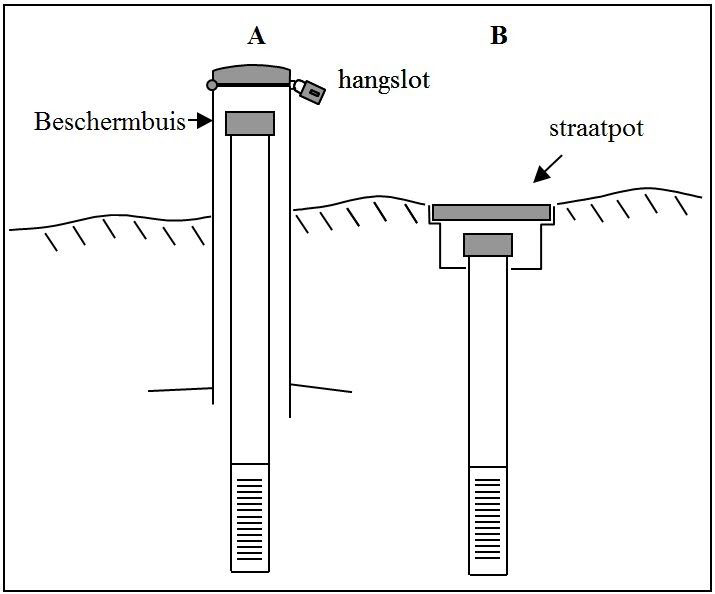
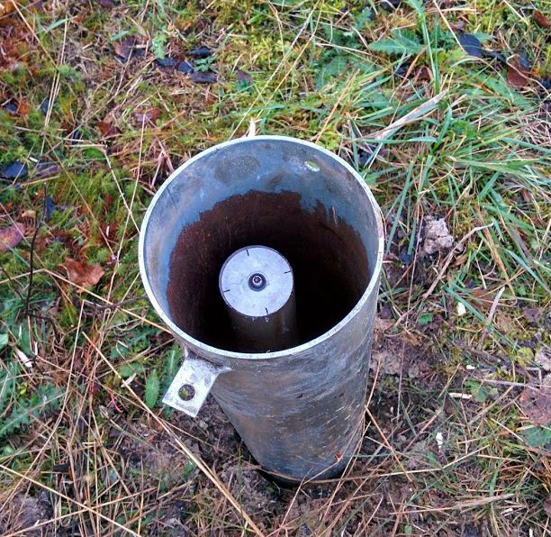

# Werkwijze

Alvorens te starten met meten is het belangrijk om de volgende instellingen eerst te controleren en indien nodig aan te passen:

-   Horizontale nauwkeurigheid: 0,015 m
-   Verticale nauwkeurigheid: 0,025 m
-   Aantal metingen die gebruikt worden: 3 (minstens), 5 (optimaal)
-   Geoid model: hBG18 (meest recente)

## Uitvoering

Voor peilbuizen voorzien van een beschermkoker dient de beschermkoker geopend te worden en de bovenkant van de beschermkoker verwijderd te worden.
De GNSS-receiver moet op de peilbuis geplaatst worden omdat de bovenkant van de beschermkoker nooit op hetzelfde niveau staat als dat van de peilbuis (zie figuur 1).
Indien de peilbuis afgewerkt is met een peilbuisslot omdat er een datalogger/druksonde in de peilbuis actief is, dan volstaat het om bovenop het peilbuisslot te meten.

Voor peilschalen is het principe hetzelfde.
Bij een peilschaal wordt er dan op de rand van de beschermkoker gemeten.





```{=html}
<!--
Gedetailleerde omschrijving van alle stappen die doorlopen moeten worden om het protocol uit te voeren.
Subtitels gebruiken om elke stap te omschrijven.
-->
```

## Registratie en bewaring van resultaten

De XYZ-coördinaten worden altijd in Lambert 72 (m), mTAW (m) uitgedrukt en met een nauwkeurigheid van drie cijfers na de komma (0,001 m) genoteerd.
De GNSS-meting krijgt de code van de peilbuis/peilschaal.

De data wordt geëxporteerd als CSV-bestand en dit bestand wordt mee doorgestuurd.
Het geëxporteerde bestand moet voldoen aan de vereisten die vermeld worden in §7 Kwaliteitszorg.
Dit kan op drie manieren bekomen worden: standaard export sjabloon, aangepast export sjabloon en manueel noteren.
Voor het aangepast export sjabloon dient er contact opgenomen te worden met de leverancier.
De derde optie ‘manueel noteren’ is minder wenselijk omdat er ruimte is voor menselijke fouten.

```{=html}
<!--
Opsomming van alle resultaten die bekomen worden na de uitvoering van het protocol en hoe die resultaten geregistreerd, bewaard of opgeslagen moeten worden.
Voor metingen of observaties: verwijs naar invulformulier (met versienummer; invulformulier toevoegen in bijlage; eventueel bepaalde zaken van invulformulier verduidelijken) en/of naar apparatuur en/of softwareprogramma indien gegevens digitaal worden ingevoerd (verwijs naar `sip` (standaard instrument protocol, `<protocol-code>-YYYY.NN`) indien beschikbaar; indien geen sip beschikbaar, geef de nodige instructies om gegevens op gepaste wijzen in te kunnen geven).
Voor staalnames: geef aan hoe de stalen bewaard, gelabeld en vervoerd moeten worden.
Geef aan of de stalen voorbehandeld moeten worden.
Voor digitale foto’s en/of andere digitale bestanden: geef aan hoe en waar deze bestanden moeten worden opgeslagen.
Geef eventueel aan welke bestandsnamen aan de bestanden moeten gegeven worden.
-->
```
