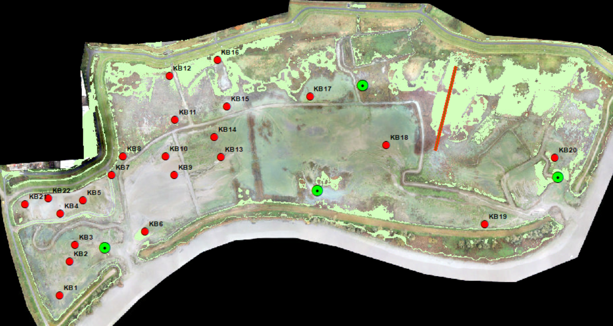
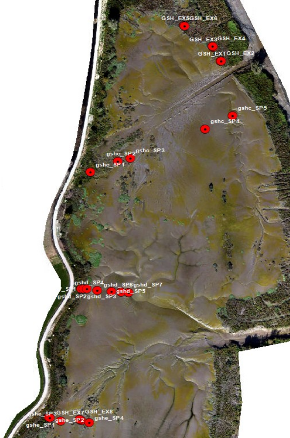
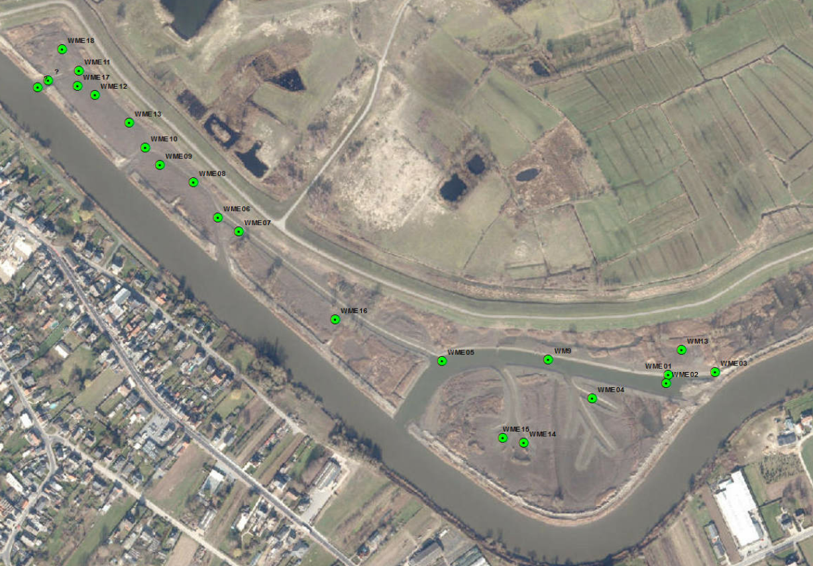
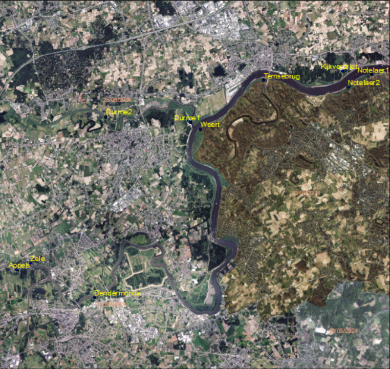
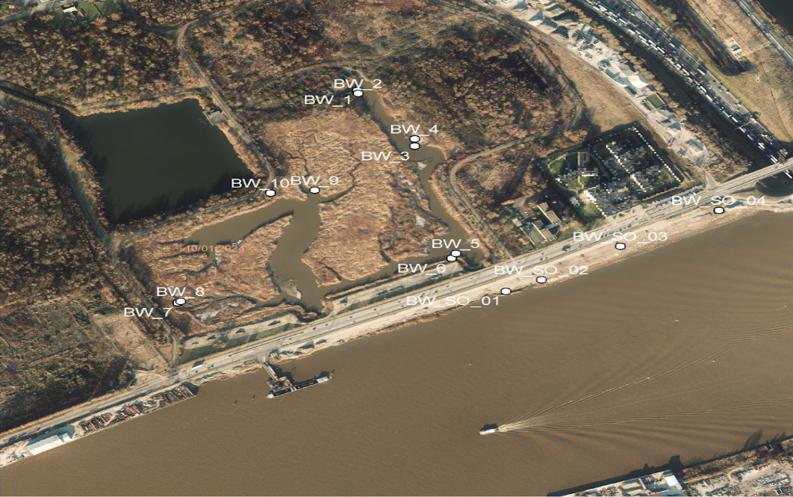

# (APPENDIX) Bijlagen {.unnumbered}

## **Overzicht van staalnames met QuickScan methode**

De voornaamste gebieden die door het INBO bemonsterd werden met de quick scan methodiek zijn Groot Schoor Hamme, Wijmeers, en Klein Broek.
Zowel de ligging van de staalnamepunten als het aantal punten zijn doorheen de jaren aangepast naargelang de evolutie van de gebieden en nieuwe onderzoeksvragen.

### Klein Broek (staalname 2025)

De selectie van de vaste staalnamepunten gebeurde op basis van drie criteria:

1.  zones die na realisatie van de ontpoldering als hoog slik of potentieel pionierschor gekarakteriseerd zijn,

2.  zones waar meer dan 5 cm sedimentatie is opgetreden tussen oktober 2023 en januari 2024, en

3.  locaties waar op dronebeelden een microfytobenthosfilm zichtbaar was.

Binnen deze potentiële zones werden tien staalnamepunten geselecteerd, en tien bijkomende punten buiten deze zones, maar in delen die wel voldeden aan de criteria hoog slik en sedimentatie (Figuur \@ref(fig:Figuur1)).
Deze staalnamepunten werden aangevuld met een hoogteraai (6 punten op een hoogtegradiënt variërend van 6.00 tot 4.00 mTAW).

Sinds 2025 richt de monitoring in Klein Broek zich op de effecten van mitigatiemaatregelen.
Specifiek worden de effecten van droogzetting/ inundatie /alle toekomstige geplande veranderingen op de populatie knijten gevolgd.

```{r Figuur1, fig.cap="Staalnamepunten in Klein Broek (rood). De hoogteraai is aangeduid met een rode streep. Locaties van peilbuizen zijn in het groen aangeduid."}

```

### Groot Schoor Hamme (2022-2025)

INBO monitorde in 2022 de knijtenlarven op de uitgelegde hoogteraaien ‘c’ en ‘e’, en in 2023 ook op een extra tussenliggende raai ‘d’.
Bijkomend werden er 8 extra punten geselecteerd vanaf 2024, waarbij telkens een punt aan de schorrand en één in het schor is gelegd (Figuur \@ref(fig:Figuur2).
Het huidige aantal staalnamepunten ligt hierbij op 24.

```{r Figuur2, fig.cap="Staalnamepunten in Groot Schoor Hamme."}

```

### Wijmeers (2023-2024)

De vaste staalnamepunten in Wijmeers werden initieel geselecteerd op basis van luchtfoto’s en nadien bijgesteld tijdens een terreinbezoek in 2023.
Tijdens dit terreinbezoek werd voornamelijk in het westelijke deel van het gebied geschikt habitat voor knijten vastgesteld.
Vanaf 2024 werden bijkomende punten toegevoegd naar aanleiding van meldingen van knijten in de omgeving, ondanks de afwezigheid van larven in de oorspronkelijke stalen.
In totaal zijn er twintig staalnamepunten, waarvan er tien in de westelijke zone liggen en tien verspreid over andere zones met potentieel geschikt habitat (Figuur \@ref(fig:Figuur3)).

```{r Figuur3, fig.cap="Staalnamepunten in Wijmeers."}

```

### Slikgebieden Zeeschelde

In de slikgebieden van de Zeeschelde heeft de QuickScan als doel het aantonen dat ook in de Zeeschelde grote bronpopulaties van knijten kunnen voorkomen.

Binnen elk ‘hotspot’ gebied worden drie geschikte locaties geselecteerd, gebaseerd op luchtfoto’s en kenmerken zoals hoog, laagdynamische slik met een korte overstromingsduur en een zichtbare laag groenalgen.
Staalnames gebeuren verder volgens de QuickScan methode hierboven uitgelegd.

Op basis van deze criteria werden 14 potentiële hotspots geselecteerd langs de Schelde (stroomopwaarts van Antwerpen) en de Durmemonding: Rupelmondse Kreek, Notelaer 1 - 2, kijkverdriet, temsebrug, Weert, Branst, Haven Moerzeke (Vlassenbroek), Dendermonde, Zele, Appels, en Durme 1-2.
Door tijdslimieten zijn 10 van de 13 locaties effectief bemonsterd (Figuur \@ref(fig:Figuur4)).
Rupelmondse Kreek, Moerzeke, en Branst zijn niet genomen.

```{r Figuur4, fig.cap="Geselecteerde ‘hotspot’ locaties langs de Zeeschelde."}

```

### Burchtse Weel

Deze staalnamecampagne had als doel te evalueren of knijtenlarven aanwezig zijn in de slikken binnen de recent herstelde slik- en schorhabitats langs de Schelde, gelegen vóór de Burchtse Weel.

Er werden 4 staalnamepunten bemonsterd in de slikken aan de Scheldekant.
Daarnaast werden tien staalnamepunten in de Burchtse Weel zelf bemonsterd, waarbij telkens één punt op de schorrand en één punt in het aangrenzende open slik werd genomen (Figuur \@ref(fig:Figuur5)).

```{r Figuur5, fig.cap="Staalnamepunten in Burchtse Weel."}

```

