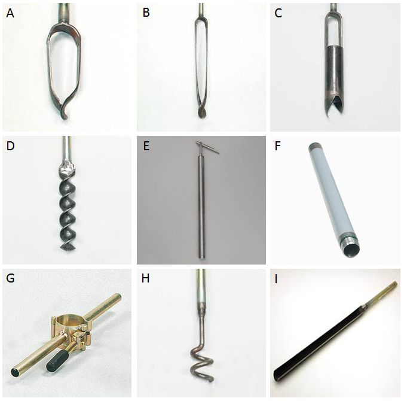

# Benodigdheden

## Apparatuur

```{=html}
<!--
Opsomming van de apparatuur die nodig is en verwijzingen naar de sip's (Standard Instrument Procedure; <protocol-code>-YYYY.NN) indien die er zijn.
Indien geen specifiek sip's voorhanden, illustreer de toegelaten apparatuur met foto's, geef het exacte type apparatuur mee, ...
-->
```
## Apparatuur

### Boormateriaal

-   Voor vaste sedimenten

    -   **Edelmanboor** (diameter 7 cm.) (foto \@ref(fig:foto1)A) met de nodige verlengstukken.

    -   **Smalle versie van de Edelmanboor** (foto \@ref(fig:foto1)B) om in zware klei-/leembodems te boren

    -   **Riversideboor** (foto \@ref(fig:foto1)C) harde, stugge grond (bv. droge kleigrond) of grond met fijn grind.

    -   **Spiraalboor** (foto \@ref(fig:foto1)D).
        harde, stugge grond.
        Voornamelijk om harde lagen te doorboren of voor te boren

-   Bij losse sedimenten (zand, fijn grind, ...) waarbij gedurende het boren het boorgat voortdurend dichtslibt

    -   **Pulsboor** voor losse sedimenten (foto \@ref(fig:foto1)E) (uitsluitend in combinatie met verbuizing)

    -   **Verbuizing + 2 klemmen** (foto \@ref(fig:foto1)F, G).
        In los sediment en bij voortdurend dichtslibbend boorgat nodig om het boorgat open te houden.

    -   **emmer (ca. 5-10 l)** om voor het ophalen van de pulsboor water in de verbuizing te gieten om te beletten dat ze mee omhoog komt bij het ophalen van de gevulde pulsboor

-   Verwijderen van stenen

    -   keienvanger (foto \@ref(fig:foto1)H)

-   Verkennende boring

    -   Gutsboor (foto \@ref(fig:foto1)I)

{width="5.068562992125984in" height="5.026042213473316in"}

### GPS (Global Positioning System) toestel

De nauwkeurigheid is afhankelijk van het type toestel.
Voor een ruwe plaatsbepaling (nauwkeurigheid van een paar meter in het horizontale vlak) volstaat een handGPS of een GPS in een smartphone.
Om de verticale positie voldoen die toestellen absoluut niet.
De hoogte kan alleen nauwkeurig ingemeten worden (\< 5cm afwijking) met behulp van een RTK-GPS.

## Materiaal

```{=html}
<!--
Opsomming van gebruikte materialen.
Duidelijk aangeven welke materialen toelaatbaar zijn, welke volumes, afmetingen, materiaal, ... 
vb. vermeld niet staalnamepotje, maar wel: vierkant flesje, volume 250 ml, gegradueerd, vervaardigd uit PE, met afsluitbare deksel uit PP.
-->
```
We onderscheiden twee types peilbuizen: een basisversie in PVC en een alternatieve versie is in HDPE.

### Materiaal voor een peilbuis in PVC (zie ook uitvoering)

-   Blinde buis, PVC, diameter 50mm.
    Lengte in functie van de diepte

-   Filterbuis, PVC, diameter 50mm.

-   Afsluitdop, PVC, diameter 50mm, te lijmen, geschikt om peilbuis onderaan af te sluiten.

-   Schroefdop, PVC, diameter 50mm, schroefdraad, geschikt om de peilbuis bovenaan af te sluiten

-   Koppelstukken (moffen) voor PVC buizen.
    diameter 50mm.
    Twee of meer stuks per peilbuis

-   PVC lijm potje van 50-100 ml met borsteltje aan het afsluitdopje(enkel voor PVC materiaal - niet gebruiken bij HDPE)

-   Filterkous (polypropyleen, 30-65 mm diameter)

-   Plastic riempjes voor het vastzetten van de filterkous (kabelbinder), minstens 20cm lengte.

### Materiaal voor een peilbuis in HDPE (zie ook uitvoering) {#materiaal_hdpe}

-   Blinde buis, HDPE, diameter 50mm.
    Lengte in functie van de diepte

-   Filterbuis, HDPE, diameter 50mm.

-   Afsluitdop, HDPE, diameter 50mm, om de peilbuis onderaan af te sluiten

-   Topdop, HDPE, diameter 50mm, op peilbuis bovenaan af te sluiten

-   Koppelstukken (klemmoffen) in HDPE.
    diameter 50mm.
    Twee stuks of meer per peilbuis

-   **GEEN PVC LIJM GEBRUIKEN!!!**

-   Filterkous (polypropyleen, 30-65 mm diameter)

-   Plastic riempjes voor het vastzetten van de filterkous (kabelbinders), minstens 20cm lengte.

### Materiaal voor de afwerking (zie ook uitvoering) (foto \@ref(fig:foto2))

-   Bentonietkorrels QSE (optioneel)

-   Filterzand SiO2 (optioneel, ter bevordering van de grondwatertoestroming rond de filter)

-   Filtergrind (optioneel, ter bevordering grondwatertoestroming rond de filter)

-   Beschermbuis met kap (optioneel), elektrolytisch verzinkt, diameter 77mm, met afsluitbaar deksel en ondergrondse verankering (foto \@ref(fig:foto2)A)

-   Straatpot 200x200mm (optioneel), vloeistofvrij, met of zonder inbus afsluiting (foto \@ref(fig:foto2)B)

{width="5.828125546806649in" height="2.865168416447944in"}

### Werkmateriaal

-   Emmer om de buis met water te vullen

-   IJzerzaag, geschikt voor het doorzagen van PVC of HDPE buizen

-   Meetlint of meetlat (cm)

-   Peilklokje om de lengte van de buis na de installatie op te meten

-   Permanente marker

-   Schaar of mes

-   Waterbestendige stift voor het aanbrengen van het buisnummer

-   Voorhamer en houten blok (enkel voor plaatsen van metalen beschermbuis

-   Spade (voor plaatsen van straatpot of voor boren op harde ondergrond)

Documentatie om de locatie te beschrijven:

-   Aanduiding op orthofoto en/of topografische kaart

-   X en Y coördinaat (WGS84 of Lambert coordinaten) met GPS

-   Beschrijving van de toegankelijkheid van het terrein, situatieschets, vegetatietype

## Reagentia en oplossingen (indien van toepassing)

```{=html}
<!--
Een opsomming van reagentia, welke zuiverheid, volume, veiligheidsvoorschriften.
vb. Zwavelzuur (H2SO4), geconcentreerd (96%), pro analyse + veiligheidsinfo (sterk zuur, bijtend, gebruik handschoenen, bril en masker bij gebruik)
Een opsomming van oplossingen, welke zuiverheid, volume, veiligheidsvoorschriften.
Indien deze oplossingen zelf worden bereid, vermeld dan ook de bereidingswijze.
vb: Zwavelzuur 1M: verdun zwavelzuur geconcentreerd 18 maal met ultrapuur water.
Opgelet: giet altijd zwavelzuur bij water en nooit omgekeerd!
-->
```
Niet van toepassing.
