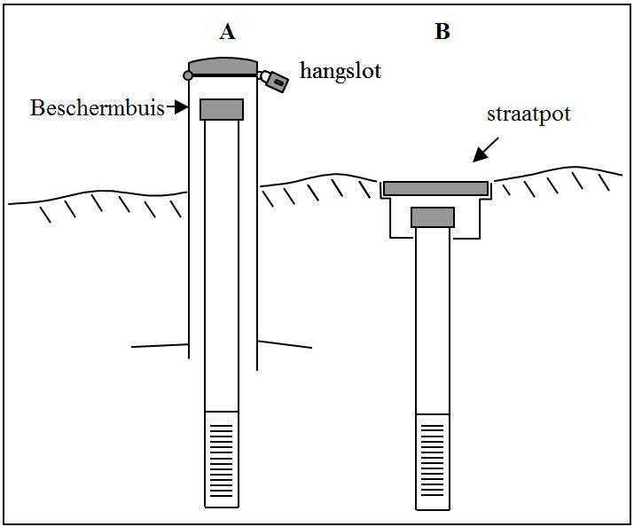

# Werkwijze

Het plaatsen van een piëzometer gebeurt best wanneer de grondwaterstand het laagste is (meestal einde zomer tot oktober).
Het kan evenwel ook op andere momenten van het jaar, maar dan is de fysieke inspanning groter.
Het is dan makkelijker om in te schatten hoe diep de peilbuis moet worden geplaatst.
Het boren is ook eenvoudiger in de onverzadigde zone.
Eens de verzadigde zone bereikt stort het boorgat bij losse sedimenten snel in en is het vaak moeilijk nog dieper te boren.
Wanneer het boorgat invalt kan een verbuizing oplossing bieden (zie verder).

Enkele praktische tips:

-   Plaats het meetpunt zo dat het makkelijk terug te vinden is, ook in de zomer-vegetatie.
    Zaag de buis daarom niet te laag boven de grond af (+/- 50cm).

-   Goed zichtbare meetpunten zijn makkelijk slachtoffer van vandalisme.
    Een verdekte opstelling heeft op dat vlak voordelen.
    Plaats in drukke gebieden eventueel een beschermkap met een hangslot rond de peilbuis of gebruik een straatpot.

-   Plaats de peilbuis zodanig dat ze vlot bereikbaar zijn (bijvoorbeeld langs een traject dat regelmatig wordt gevolgd) en waar ze geen verstoring veroorzaken (bijvoorbeeld tijdens het broedseizoen).

-   Plaats de buizen zo dat ze niet hinderen bij de beheerwerkzaamheden (voornamelijk maaien).
    Het best aan de rand van een perceel, waar er niet gemaaid wordt, ofwel met een duidelijke aanduiding zoals een houten paal die zichtbaar boven de zomer-vegetatie uitkomt.
    Men kan de peilbuis ook onder een afsluiting plaatsen of ondergronds afwerken.

## Uitvoering

```{=html}
<!--
Gedetailleerde omschrijving van alle stappen die doorlopen moeten worden om het protocol uit te voeren.
Subtitels gebruiken om elke stap te omschrijven.
-->
```
Het plaatsen van een peilbuis bestaat uit verschillende stappen.
De peilbuis wordt best klaargemaakt vooraleer te starten met het boren.

-   Het klaarmaken van de buis

-   Het maken van een boorgat

-   Het maken van een boorverslag

-   Het plaatsen van de buis in het boorgat

-   De afwerking

-   De identificatie en inmeten van het meetpunt

### Klaarmaken van de buis

#### Materiaaltype

In de meeste gevallen volstaat een eenvoudige PVC buis.
Enkel in verontreinigde bodems en wanneer gepland wordt om grondwaterstalen uit de peilbuis op deze stoffen te analyseren, zijn HDPE buizen vereist.
Deze zijn heel wat duurder, maar het materiaal is inert.
D.w.z. dat het geen stoffen afgeeft waardoor bij vervuild bodem- of grondwater betrouwbare analyses worden bekomen.
In deze situaties mag er dan ook **geen lijm** gebruikt worden en dient men klemmoffen te gebruiken (zie [materiaal hdpe](#materiaal_hdpe)).

#### Het filterelement

-   Voor een piëzometer: Zaag een stuk van 30 tot 50 cm filterelement af en plak het onderaan de blinde PVC buis door middel van een koppelstuk (mof) vast met PVC lijm.
    De contactoppervlakken van de beide delen kunnen voor de stevigheid en om lekken te vermijden ruw gemaakt worden met schuurpapier.
    Dit is echter optioneel.

-   Voor een grondwaterstandsbuis: De lengte van de filter is afhankelijk van de diepte van het boorgat.

#### De filterkous

Een filterkous is nodig om geleidelijk dichtslibben van de buis met sediment zoveel mogelijk te voorkomen.
Een stuk filterkous wordt op de juiste lengte gebracht, onder de filter geknoopt en boven de filter vastgemaakt met een plastic riempje (kabelbinder).

#### Afsluiting onderaan

Het is belangrijk dat de buis onderaan (onder het filterdeel) goed afgesloten is.
Zoniet kan de peilbuis geleidelijk dichtslibben met sediment.
De afsluitdop en de filter kunnen ruw gemaakt worden met schuurpapier en alvorens deze met PVC lijm worden bevestigd.

### Het maken van een boorgat

Hiervoor gebruik je de geschikte grondboor, afhankelijk van het sediment.
Het is aangewezen om altijd eerst met een Edelmanboor te starten.
Er dient diep genoeg geboord te worden om er zeker van te zijn dat er bij lage grondwaterstanden in de zomer nog water in de peilbuis staat.
Een maatstaf hiervoor is de reductiehorizont (niet altijd zichtbaar).
De reductiehorizont wordt tevens ook wel de permanent verzadigde zone genoemd vanwege het feit dat deze het hele jaar rond voorzien is van grondwater.
Waar de reductiehorizont begint krijgt de grond veelal een egale grijsblauwe tot blauwe kleur.
Zolang er veel roestige vlekken (gley) in het opgeboorde materiaal zijn, zit je nog niet diep genoeg.
De gley is een aanduiding dat er nog periodieke oxidatie optreedt en de bodem niet continu verzadigd is.

Je boort het gat tot ongeveer 1m in de reductiehorizont, een niveau dat ongeveer overeenkomt met het diepste peil van het grondwater in de zomer.
Voor het overgrote gedeelte van Vlaanderen dienen boorgaten op zijn minst 1.50 meter diep te zijn.
Alleen in venige vegetatietypen waarbij de amplitude van het grondwater gering is kunnen ondiepere buizen voorkomen.
In andere vegetatietypen zijn ondiepere buizen doorgaans onbetrouwbaar vanwege het verwachte droogvallen van de buis.
Maar opgelet, in vele Vlaamse natuurgebieden waar ook veenafzettingen voorkomen (zoals in de meeste Kempische beekdalen) zijn er nogal wat drainagestructuren aanwezig waardoor ook die van nature erg natte en permanent met grondwater verzadigde bodems droogvallen in de zomer (en mineraliseren).
Het is dus aan te raden om ook in veenbodems diepere boorgaten te maken dan op het eerste zicht noodzakelijk lijkt (in ieder geval proberen om minstens één meter en bij voorkeur anderhalve meter die te gaan).
Om te vermijden dat er dan peilen gemeten worden in de peilbuis die (veel) hoger zijn dan het effectieve grondwaterpeil, is het aangewezen om hier effectief een peilbuis (ipv een piëzometer) te plaatsen, dus met een filter van 1 meter lengte.

Wanneer het boorgat steeds weer instort, bv.
in een zandige of grindige ondergrond wordt er gebruik gemaakt van een verbuizing (foto \@ref(fig:foto1), F).
Er wordt dan een mantelbuis geplaatst die het boorgat intact houdt en waar het materiaal onderaan van binnenuit weggehaald kan worden.
Na het plaatsen van de peilbuis wordt de mantelbuis weggehaald.
Tijdens het weghalen van de mantelbuis in vochtig en los sediment kan er een vacuum effect gecreëerd worden waardoor de peilbuis mee omhoog gezogen wordt.
Om te voorkomen dat de peilbuis terug omhoog komt wordt deze best volledig gevuld met water.
Soms is het sediment zo los dat er met een Edelmanboor geen materiaal meer opgehaald wordt.
Als alternatief kan dan een pulsboor een uitweg bieden (foto \@ref(fig:foto1), E).
Een pulsboor is een lange buis met onderaan een afsluitklep.
Door de boor regelmatig op en neer te bewegen (pulsen) wordt het sediment losgewoeld en in de buis verzameld en zo afgevoerd.

### Het maken van een boorverslag

Een gedetailleerde geologische beschrijving van de boring is niet nodig, maar het is wel belangrijk een aantal kenmerken van de ondergrond te noteren.
Het kan later de metingen van de peilbuis helpen verklaren.
De kenmerken die moeten genoteerd worden staan in bijlage 2: checklist boorverslag.

### Plaatsing van de buis

Plaats zo snel mogelijk de klaargemaakte peilbuis in het boorgat.
Het boorgat rond de buis wordt opgevuld met het opgeboorde sediment.
Daarbij wordt rekening gehouden om de volgorde van de horizonten te behouden.
De grond moet goed met de hand aangeduwd worden.
Zo niet zal de peilbuis later veel te gemakkelijk bewegen.
Probeer zoveel mogelijk aangeboord sediment te gebruiken.
Zwaardere stukken leem en klei worden best vermeden wanneer er later een beschermbuis overheen moet.
De harde stukken kunnen de peilbuis bij het plaatsen van de beschermbuis beschadigen.

Zolang de buis nog niet vol water is gelopen kan die als een dobber naar boven worden geduwd.
Indien dit het geval is, houd de buis enkele minuten tegen totdat de waterdruk binnen en buiten de buis gelijk is of giet een behoorlijke hoeveelheid water (niet meer dan een emmer) in de buis.

### Afwerking

De blinde buis wordt op een geschikte hoogte afgezaagd.
De geschikte hoogte varieert naargelang de afwerking van het meetpunt en of er al dan niet overstroming in het gebied wordt verwacht.
Voor een peilbuis zonder specifieke afscherming is 40 à 50 cm boven het maaiveld meestal een goede keuze.
Zoals eerder aangehaald kan de aard en het beheer op de locatie bepalend zijn voor de afwerking van het meetpunt.

De afsluitdop wordt best na het plaatsen vastgelijmd met PVC lijm.
De lucht boven het wateroppervlak in de buis moet vrij kunnen in- en uitstromen.
Hiervoor wordt net onder de afsluitdop een kleine sleuf gezaagd.
Zonder dergelijke luchtopening komt de buis in over- of onderdruk ten aanzien van de atmosferische druk en zal het peil in de buis niet de werkelijke drukhoogte aangeven.

De afwerking kan zowel bovengronds als ondergronds (Figuur \@ref(fig:Figuur2)).

{width="4.223958880139983in" height="3.5081528871391074in"}

Een bovengrondse afwerking is aangewezen wanneer verwacht wordt dat het water boven het maaiveld kan stijgen.
In kwelgebieden kan het water in de buis boven het maaiveld stijgen!
Dit merk je niet altijd bij het plaatsen.
Zorg daarom voor een voldoende hoge afwerking zodat de buis niet overloopt.
Meestal zal de drukhoogte niet hoger zijn dan één meter boven het maaiveld.
Loopt de buis toch over, dan kan je die achteraf makkelijk verhoogd worden.
De nieuwe hoogte van het nulpunt moet dan wel nauwkeurig gemeten en doorgegeven worden, evenals de datum waarop deze aanpassingen gebeurd zijn..
Locaties waar kwel kan verwacht worden zijn doorgaans valleigebieden en percelen op of onderaan een helling.

Bovengronds kunnen buizen beschermd worden door er een **metalen beschermbuis** met een minimale lengte van 1 meter overheen te plaatsen (Figuur \@ref(fig:Figuur2), B).
Ze kunnen afgesloten worden met een hangslot.Indien er geopteerd wordt om een beschermbuis te plaatsen dan wordt de buis het best afgewerkt tussen de 30 - 40 cm boven het maaiveld om te zorgen dat de beschermbuis optimaal verankerd (minimaal 60 cm moet ondergronds zitten) zit in de bodem.
Voor het plaatsen van de beschermbuis is er een metalen/houten voorhamer en een blok hout nodig.
De blok hout dient om te voorkomen dat de beschermbuis schade oploopt door de hamerslagen tijdens de plaatsing.
Alvorens te beginnen dient de peilbuis eerst afgesloten te worden om te voorkomen dat er tijdens het inkloppen van de metalen beschermbuis, brokjes materiaal in de buis kan terecht komen.
Dit kan met een plastieken zakje of met een (al dan niet tijdelijke) dop.
De metalen beschermbuis wordt over de peilbuis op de het maaiveld gezet, het houten blok wordt op de beschermbuis geplaatste en vervolgens wordt de buis (met het houten blok erop) de bodem in geklopt.
Bij een harde bodem kan er voor het plaatsen van de beschermbuis best eerst met een spade gestoken worden rondom de peilbuis.
Dit zal ervoor zorgen dat de beschermbuis makkelijker de grond ingeklopt kan worden.
De beschermbuis wordt in de grond geklopt totdat de bovenrand 1 à 2 cm boven de bovenrand van de peilbuis uitsteekt.
Tijdens het plaatsen moet erop gelet worden dat de peilbuis recht in de beschermbuis staat.
Anders kan de buis onder het maaiveld beschadigd worden door de beschermbuis en verliest de buis haar nut.

Als er vandalisme verwacht wordt of als de buis in het midden van een hooi- of een weiland staat, kan je de buis ook ondergronds **afwerken met een straatpot** (figuur \@ref(fig:Figuur2), B).
In zeer natte of regelmatig overstromende percelen is dit niet aangewezen.
Voor het plaatsen van een straatpot moet er rondom de buis een vierkant met de afmetingen afhankelijk van het type straatpot (normaal 30x30x20 cm) uitgegraven worden.
De buis moet een paar cm lager dan het maaiveld afgezaagd worden, zodanig dat de straatpot gelijk kan komen te liggen met het maaiveld.
De put wordt opgevuld met het uitgegraven bodemmateriaal totdat de straatpot stevig en gelijk met het maaiveld ligt.
Het overige bodemmateriaal wordt gebruikt om de straatpot langs de buitenzijde te verankeren in de bodem.

### Identificatie en inmeten van het meetpunt

Elk meetpunt krijgt onmiddellijk een eenduidige identificatiecode op de buis met een permanente marker.
Schrijf de identificatie op minstens twee plaatsen op de buis van de peilbuis.
Schrijf de identificatie niet op de dop, die kan per ongeluk verwisseld worden.

Nieuwe meetpunten worden onmiddellijk gelokaliseerd op een kaart en/of ingemeten met een GPS.
In de beschrijving kunnen kenmerkende punten in het landschap geschetst worden.
Belangrijk is om altijd te noteren met welk toestel het inmeten gebeurd is (handGPS, smartphone, RTK-GPS, etc.) Het inmeten omvat:

-   X,Y coördinaten.
    Met een indicatie van de nauwkeurigheid (in functie van het gebruikte toestel)..

-   Hoogte van het nulpunt (mTAW).
    Dit is de hoogte van de buis (zonder de dop).
    Een nauwkeurigheid van \< 5 cm is vereist

-   Hoogte van het maaiveld (mTAW).
    Dit is de hoogte van het maaiveld naast het meetpunt, dat niet beïnvloed is door de aanwezigheid van het meetpunt (bv. lichte verhoging door het opvullen van het boorgat).

SVP-014 beschrijft de procedure voor het nauwkeurig lokaliseren van meetpunten en het inmeten t.o.v. TAW a.d.h.v. een nauwkeurige GPS (RTK-GPS).
Inmeten t.o.v. TAW is noodzakelijk om de gemeten stijghoogte te vergelijken met meetpunten uit de omgeving en zo de patronen van de grondwaterstroming te bepalen.

## Registratie en bewaring van resultaten

```{=html}
<!--
Opsomming van alle resultaten die bekomen worden na de uitvoering van het protocol en hoe die resultaten geregistreerd, bewaard of opgeslagen moeten worden.
Voor metingen of observaties: verwijs naar invulformulier (met versienummer; invulformulier toevoegen in bijlage; eventueel bepaalde zaken van invulformulier verduidelijken) en/of naar apparatuur en/of softwareprogramma indien gegevens digitaal worden ingevoerd (verwijs naar sip (standard instrument protocol, <protocol-code>-YYYY.NN) indien beschikbaar; indien geen sip beschikbaar, geef de nodige instructies om gegevens op gepaste wijzen in te kunnen geven).
Voor staalnames: geef aan hoe de stalen bewaard, gelabeld en vervoerd moeten worden.
Geef aan of de stalen voorbehandeld moeten worden.
Voor digitale foto’s en/of andere digitale bestanden: geef aan hoe en waar deze bestanden moeten worden opgeslagen.
Geef eventueel aan welke bestandsnamen aan de bestanden moeten gegeven worden.
-->
```
Alle informatie wordt bij het plaatsen in een veldboek genoteerd.
De bijlage bevat een checklist met te noteren informatie.
Er is geen veldformulier omdat dit in het veld niet praktisch werkt.

De codering die door het INBO wordt gebruikt bestaat uit vier delen en bevat 8 karakters:

-   De eerste drie letters vormen de gebiedscode (bv. voor de Dijlevallei: DYL)

-   De vierde letter is een indicatie van het type meetpunt.

    -   Een P staat voor peilbuis (piëzometer of grondwaterstandsbuis)

    -   Een S geeft aan dat het een peilschaal of peillat betreft

    -   Een B geeft aan dat het om een oppervlaktemeting gaat naast het meetpunt (bv. bij overstromingen)

    -   Een W geeft aan dat het om een waterput gaat (doorgaans betonnen cilinders)

-   Vervolgens geven drie cijfers (bv. 030) het volgnummer van de peilbuis in het gebied weer.
    Dit cijfer moet in het veld ook vermeld staan op de buis.

-   Bij ingebruikname is de laatste letter steeds een X.
    Telkens wanneer er iets gebeurt met de buis (bv. afgemaaid) en de buis op een nieuwe hoogte boven maaiveld wordt hersteld verandert de laatste letter.
    Bij een eerste wijziging wordt dit een A, bij een tweede een B, een derde een C, ... enz
