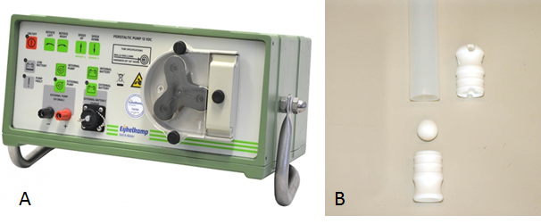
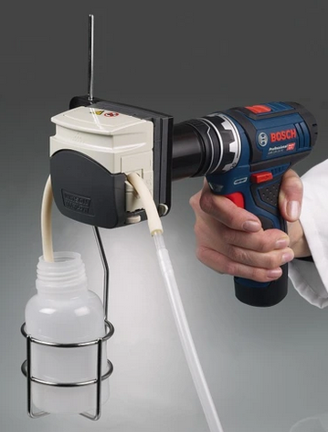

# Benodigdheden

## Apparatuur

```{=html}
<!--
Opsomming van de apparatuur die nodig is en verwijzingen naar de sip's (Standard Instrument Procedure; <protocol-code>-YYYY.NN) indien die er zijn.
Indien geen specifiek sip's voorhanden, illustreer de toegelaten apparatuur met foto's, geef het exacte type apparatuur mee, ...
-->
```
-   Geschikt materiaal voor het nemen van een grondwatermonsters uit peilbuis

    -   Peristaltische slangenpomp (Figuur \@ref(fig:Figuur1) A), Eijkelkamp, 12 vdc, regelbaar in twee richtingen tussen de 100 en 2.300 ml/min, met zuigcapaciteit tot 9,5 m diepte.
        Deze pomp is voorzien van een batterij met levensduur van 4,5 uur en een pompslang in silicone.

    -   Kogelklepmonsternemer, Eijkelkamp, 35mm, 90cm in teflon (Figuur \@ref(fig:Figuur1) B).

> {width="6.302777777777778in" height="2.611111111111111in"}

-   Boormachine met peristaltische kop (Figuur \@ref(fig:Figuur2))

> {width="2.170223097112861in" height="2.8593755468066493in"}

-   Veldset voor het bepalen van de zuurtegraad en de geleidbaarheid: het analytische laboratorium beschikt over verschillende veldsets (WTW multi, pH-EC) met de nodige elektroden welke kunnen gebruikt worden op het terrein voor deze bepalingen.
    De werking, het gebruik, de kalibratie en het onderhoud van deze veldsets wordt beschreven in [SIP-054](https://sites.google.com/inbo.be/veldprotocollen/standaard-instrument-procedures-sip) (kwaliteitshandboek analytisch labo).

-   Frigobox met koelelementen.

## Materiaal

```{=html}
<!--
Opsomming van gebruikte materialen.
Duidelijk aangeven welke materialen toelaatbaar zijn, welke volumes, afmetingen, materiaal, ... 
vb. vermeld niet staalnamepotje, maar wel: vierkant flesje, volume 250 ml, gegradueerd, vervaardigd uit PE, met afsluitbare deksel uit PP.
-->
```
-   Ronde borstel (diameter 50mm) voor het reinigen van de piëzometer.

-   Tubing, teflon, diameter?,
    voor het ledigen en reinigen van de peilbuizen

-   Monsternamepot HDPE (minstens 750ml) voor het opvangen van het watermonster en het meten van de ogenblikkelijke variabelen op het terrein.

-   Recipiënten voor chemische analysen (zie [SOP-006](https://sites.google.com/inbo.be/veldprotocollen/standaard-veld-procedures-svp/0-generiek)).
    De voornaamste recipiënten gebruikt bij grondwateranalyse zijn:

    -   Fles, 250 ml rode of witte dop (FL-250R of FL250W)

    -   Falcontube, 30 ml met witte dop (FT-30W), aangezuurd met HNO~3~ (250$\mu$l/tube)

    -   Falcontube, 50 ml met rode dop (FT-50R)

    -   Gebundeld in zak van 16x25 cm

-   Spuit, 100 of 250 ml, met schroefdraad voor spuitfilter

-   Filter, type spuitfilter, 0,20 $\mu$m of 0,45 $\mu$m

-   Gedemineraliseerd water

## Reagentia en oplossingen (indien van toepassing)

```{=html}
<!--
Een opsomming van reagentia, welke zuiverheid, volume, veiligheidsvoorschriften.
vb. Zwavelzuur (H2SO4), geconcentreerd (96%), pro analyse + veiligheidsinfo (sterk zuur, bijtend, gebruik handschoenen, bril en masker bij gebruik)
Een opsomming van oplossingen, welke zuiverheid, volume, veiligheidsvoorschriften.
Indien deze oplossingen zelf worden bereid, vermeld dan ook de bereidingswijze.
vb: Zwavelzuur 1M: verdun zwavelzuur geconcentreerd 18 maal met ultrapuur water.
Opgelet: giet altijd zwavelzuur bij water en nooit omgekeerd!
-->
```
-   Salpeterzuur 65%, suprapur, HNO~3~: hiervan bevindt zich 250 $\mu$l in de falcontubes van 30 ml (FT-30W).
