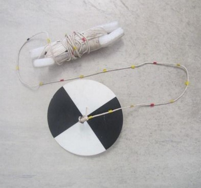

# Benodigdheden

## Apparatuur

```{=html}
<!--
Opsomming van de apparatuur die nodig is en verwijzingen naar de `sip`'s (Standaard Instrument Procedure; `<protocol-code>-YYYY.NN`) indien die er zijn.
Indien geen specifiek `sip`'s voorhanden, illustreer de toegelaten apparatuur met foto's, geef het exacte type apparatuur mee, ...
-->
```
Niet van toepassing.

## Materiaal

```{=html}
<!--
Opsomming van gebruikte materialen.
Duidelijk aangeven welke materialen toelaatbaar zijn, welke volumes, afmetingen, materiaal, ... 
Vermeld bijvoorbeeld niet staalnamepotje, maar wel: vierkant flesje, volume 250 ml, gegradueerd, vervaardigd uit `PE`, met afsluitbare deksel uit `PP`.
-->
```
### Secchi-schijf

Een secchi-schijf met stevig rek- en krimpresistent koord van voldoende lengte (lengte moet minimum gelijk zijn aan de diepte van de gemeten locatie) dat correct en stevig aan het oog van de secchi-schijf bevestigd is (Figuur \@ref(fig:Figuur1)).
Bij voorkeur staan op het koord lengtemarkeringen die de diepte aanduiden gemeten vanaf het bovenoppervlak van de secchi-schijf.
Een secchi-schijf bestaat uit een cirkelvormige plaat met een diameter van 20 cm, bovenaan afwisselend beschilderd met twee zwarte en twee witte sectoren van gelijke grootte.

```{r Figuur1, fig.cap= "Secchi-schijf met maatverdeling op het touw"}



```

### Rolmeter, vouwmeter of meetlint

Om de diepte (gemeten op het koord van de secchi-schijf) te meten indien het koord van de secchi-schijf niet voorzien is van dieptemarkeringen en om de waterdiepte te bepalen.

## Reagentia en oplossingen (indien van toepassing)

```{=html}
<!--
Een opsomming van reagentia, welke zuiverheid, volume, veiligheidsvoorschriften.
Bijvoorbeeld. Zwavelzuur (`H2SO4`), geconcentreerd (96%), pro analyse en veiligheidsinfo (sterk zuur, bijtend, gebruik handschoenen, bril en masker bij gebruik)
Een opsomming van oplossingen, welke zuiverheid, volume, veiligheidsvoorschriften.
Indien deze oplossingen zelf worden bereid, vermeld dan ook de bereidingswijze.
bijvoorbeeld: Zwavelzuur `1M`: verdun zwavelzuur geconcentreerd 18 maal met `ultrapuur` water.
Opgelet: giet altijd zwavelzuur bij water en nooit omgekeerd!
-->
```
Niet van toepassing.
