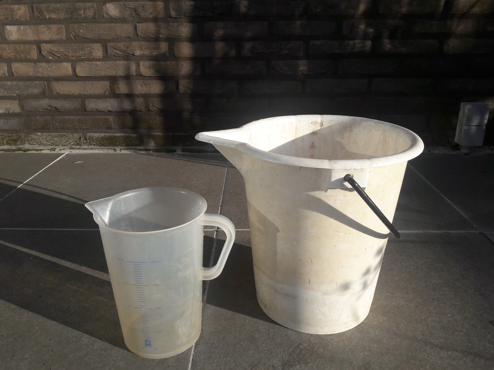
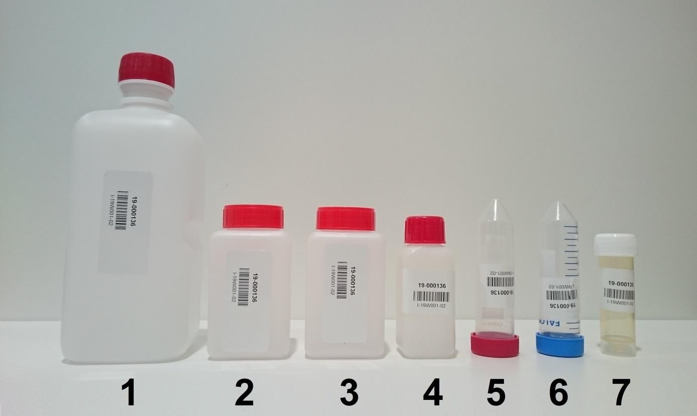
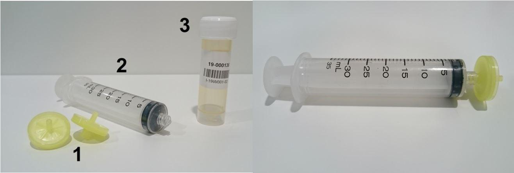

# Benodigdheden

Tabel 1 geeft een overzicht van de benodigde apparatuur en materiaal voor het nemen van een waterstaal.
Onder 7.1, 7.2 en 7.3 worden een aantal specifieke benodigdheden van verdere uitleg voorzien.

+:------------------------------------------------------------+:--------------------------------------------------------------------------+
| -   staalnameformulieren & protocol of digitaal alternatief | -   staalname-emmer                                                       |
+-------------------------------------------------------------+---------------------------------------------------------------------------+
| -   klembord, potlood en slijper                            | -   maatbeker                                                             |
+-------------------------------------------------------------+---------------------------------------------------------------------------+
| -   laarzen, lieslaarzen, waadpak (plaatsafhankelijk)       | -   spuiten en filters                                                    |
+-------------------------------------------------------------+---------------------------------------------------------------------------+
| -   latex handschoenen (poederloos)                         | -   koelbox met koelelementen                                             |
+-------------------------------------------------------------+---------------------------------------------------------------------------+
| -   plooimeter                                              | -   reserverecipiënten en hersluitbare zakjes                             |
+-------------------------------------------------------------+---------------------------------------------------------------------------+
| -   fototoestel                                             | -   documentatie van het staalnamepunt om dit exact te kunnen lokaliseren |
+-------------------------------------------------------------+---------------------------------------------------------------------------+
| -   recipiënten                                             | -   hamer om een gat in het ijs te maken                                  |
+-------------------------------------------------------------+---------------------------------------------------------------------------+

Tabel 1: Checklist benodigd veldmateriaal.

## Apparatuur

Niet van toepassing

## Materiaal

**Staalname-emmer**

Witte emmer (polyethyleen), inhoud 10 l, met maatmarkering en giettuit (figuur 1).

**Maatbeker**

Doorzichtige maatbeker (polypropyleen), inhoud 2 l, met maatmarkering, giettuit en handvat (figuur 1).

{width="6.299660979877515in" height="4.722222222222222in"}

**Recipiënten**

Voor elk staal zijn er, bij standaard staalname, zeven recipiënten voorzien (figuur 2).
Elk recipiënt is voorzien van een label met een unieke code en een streepjescode per staal voor invoer in LIMS (= laboratory information management system).
Ieder recipiënt dient voor een specifieke analyse (

tabel 2).
Gebruik daarom steeds de correcte recipiënten (nummers refereren naar figuur 2):

-   **1**, Fles 1.000 ml (**FL-1000R**, **FL-1000W**): vierkante fles van 1.000 ml met smalle hals en platte bodem, vervaardigd uit high density polyethyleen (HDPE), gegradueerd, met rode schroefdop.

-   **2 en 3**, Fles, 250 ml (**FL-250R**, **FL-250W**, **FL-250B**): vierkante fles van 250 ml met brede hals en platte bodem, vervaardigd uit high density polyethyleen (HDPE), gegradueerd, met blauwe, rode of witte schroefdop.

-   **4**, Fles, 100 ml (**FL-100R**) : vierkante fles van 100 ml met smalle hals en platte bodem, vervaardigd uit high density polyethyleen (HDPE), niet-gegradueerd, met rode schroefdop.

-   **5**, Falcontube, 50 ml (**FT-50B**, **FT-50R, FT-50G**): cilindrisch buisje of tube van 50 ml met conische bodem vervaardigd uit polypropyleen (PP), gegradueerd, met rode schroefdop vervaardigd uit polyethyleen (PE).

-   **6**, Falcontube, 50 ml (**FT-50B**, **FT-50R, FT-50G**): cilindrisch buisje of tube van 50 ml met conische bodem vervaardigd uit polypropyleen (PP), gegradueerd, met blauwe schroefdop vervaardigd uit polyethyleen (PE).

-   **7**, Falcontube, 30 ml (**FT-30W**): cilindrisch buisje of tube van 30 ml met conische bodem met rechtstaand stuk, vervaardigd uit polypropyleen (PP), niet-gegradueerd, met witte schroefdop vervaardigd uit polyethyleen (PE).

{width="6.299660979877515in" height="3.763888888888889in"}

|               |                                    |                                                                                                |
|:--------------|:-----------------------------------|:-----------------------------------------------------------------------------------------------|
| **recipiënt** | **beschrijving**                   | **analyse**                                                                                    |
| 1             | 1 l                                | zwevende stof                                                                                  |
| 2             | 250 ml                             | chlorofyl *a*                                                                                  |
| 3             | 250 ml                             | bicarbonaatbepaling (TAP-TAM), IC (ionenuitwisselingschromatografie), controle pH en EC, kleur |
| 4             | 100 ml                             | TP (totaalfosfor), KjN (Kjelldahl-stikstof), COD (chemisch zuurstofverbruik)                   |
| 5             | Falcon 50 ml rode dop              | reservestaal                                                                                   |
| 6             | Falcon 50 ml blauwe dop            | DOC (opgelost organisch koolstof)                                                              |
| 7             | 30 ml met 300 µl salpeterzuur (1%) | ICP (metalen)                                                                                  |

Tabel 2: Analyses die uitgevoerd worden op de waterstalen van de respectievelijke recipiënten.

Houd de afzonderlijke recipiënten van eenzelfde staal steeds bijeen in de daarbij horende plastic zak met gripsluiting om te voorkomen dat recipiënten gecontamineerd worden tijdens het transport, verloren gaan of dat recipiënten van verschillende stalen door elkaar worden gehaald.

Ook dient steeds minstens één volledige set van reserverecipiënten voorhanden te zijn voor het geval een set recipiënten onvolledig is, gecontamineerd is (bijv. door het uitlopen van salpeterzuur uit recipiënt 7), of door enige andere reden onbruikbaar blijkt.

De recipiënten dienen voorafgaand aan de staalname volstrekt zuiver te worden gehouden.
Elk contact met de binnenzijde van de recipiënten en hun deksels dient te worden vermeden.

**Spuiten en filters**

Het recipiënt met salpeterzuur (recipiënt nummer 7) dient te worden gevuld met gefilterd water.
De filtratie gebeurt in het veld door de gevulde spuit te voorzien van een opzetfilter en de spuit voorzichtig te ledigen in het recipiënt.
Hiervoor worden spuiten van 35 ml met een conus met Luer-lock (schroefdraad in de conus) en A-20/25 filters met een membraan met poriëngrootte van 0,20 µm gebruikt (figuur 3).
De filter wordt met de klok mee vastgedraaid in de conus.
Om contaminatie te vermijden worden de filters slechts eenmaal gebruikt.
Meerdere filters kunnen nodig zijn voor het filteren van 25 tot 30 ml, de hoeveelheid water nodig om een ICP-analyse te kunnen uitvoeren.
De filter wordt vervangen wanneer het water er met veel druk slechts traag uit druppelt.
De spuiten kunnen voor meerdere staalnamepunten worden herbruikt, maar moeten dan steeds voorgespoeld worden met waterstaal, dit door de spuit minstens drie maal te vullen en vervolgens terug leeg te spuiten.
De spuiten worden steeds vervangen tussen sterk verschillende oppervlaktewateren en worden niet langer dan één dag gebruikt.
Bewaar ongebruikte filters steeds in een schoon, droog en goed afgesloten zakje of ander recipiënt om contaminatie te voorkomen.

{width="6.299660979877515in" height="2.138888888888889in"}

**Staalnameformulier (analoog of digitaal):**

Het staalnameformulier (zie SPP-116 bijlage 1) kan zowel digitaal als analoog ingevuld worden in het veld.
Bij voorkeur wordt tijdens de staalname steeds de analoge versie ingevuld zodat typfouten of problemen bij gegevensopslag worden vermeden en er tevens een originele versie beschikbaar is voor controle op een later tijdstip.
Het staalnameformulier wordt duidelijk leesbaar en volledig ingevuld met potlood, dat in tegenstelling tot inkt ook schrijft in natte omstandigheden en niet kan uitlopen.

**Koelbox en koelelementen**

Een ruime, dubbelwandige en goed afsluitende koelbox en ingevroren koelelementen zijn nodig om de stalen tijdens de veldwerkzaamheden en transport goed te kunnen conserveren.
De koelelementen mogen geen defecten (lekkage) vertonen.
De koelelementen en de koelbox zijn bij voorkeur gemakkelijk te reinigen om contaminatie van de stalen te voorkomen.

## Reagentia en oplossingen (indien van toepassing)

**Salpeterzuur 65%, suprapur, (HNO~3~):** Sterk zuur dat zowel irriterend en corrosief werkt.
Draag handschoenen bij gebruik, voorkom inademing van dampen en contact met de huid en ogen.
