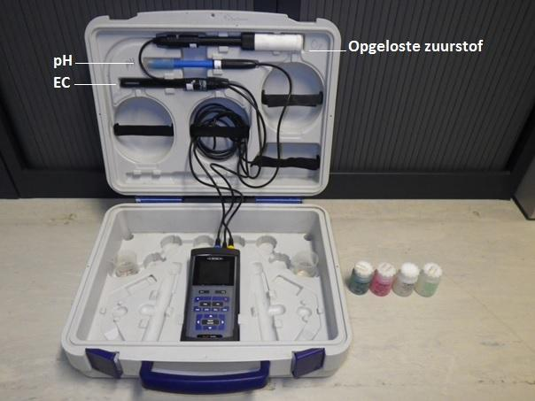
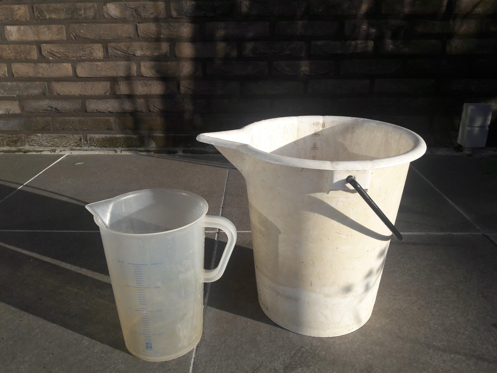

```{=html}
<!--
Instructies bij opmaak van het protocol:

Hieronder vind je de verschillende onderdelen van een protocol.
In de bijhorende losse `Rmd` bestanden vind je een beschrijving wat er bij elk onderdeel vermeld moet worden.
Het is in die bestanden dat je moet editeren.
Niet alle onderdelen zijn altijd van toepassing.
Laat in die gevallen de titels staan en vermeld expliciet "niet van toepassing".
-->
```
```{r setup, include=FALSE}
library(knitr)
opts_chunk$set(
  echo = FALSE,
  eval = TRUE,
  dpi = 300,
  fig.width = 150 / 25.4,
  fig.height = 100 / 25.4,
  out.width = "100%",
  warning = FALSE,
  error = TRUE,
  message = FALSE
)
library(dplyr)
library(purrr)
library(protocolhelper)
library(pander)
panderOptions("table.alignment.default", "left")
metadata <- rmarkdown::metadata
path_to_protocol <- get_path_to_protocol(metadata$protocol_code)
type <- get_protocol_type(metadata$protocol_code, auto_identifier = TRUE)
```

# Metadata {.unnumbered}

```{r metadata-table}
tibble(
  reviewers = metadata[["reviewers"]] |> paste(collapse = ", "),
  documentbeheerder = metadata[["file_manager"]],
  protocolcode = metadata[["protocol_code"]],
  versienummer = metadata[["version_number"]],
  taal = metadata[["language"]],
  thema = metadata[["theme"]]
) %>%
  pander::pander(split.tables = Inf)
```

```{r results="asis"}
sprintf("Controleer [deze tabel](../%s.html){target=\"_blank\"} om te zien of een meer recente versie beschikbaar is.", type) |> cat() # nolint
```

<!--chapter:end:index.Rmd-->

# Wijzigingen t.o.v. vorige versies

## [2024.04](../2024.04/index.html)

-   Dit is de eerste versie van het protocol

```{=html}
<!--
Omschrijf hier welke wijzigingen er gebeurd zijn ten opzichte van de vorige versie. 
Vermeld bij elk versienummer, de reden van de wijziging en - wanneer relevant - een beknopte beschrijving van de wijziging.
Gesorteerd van recent naar oud. 

## [2020.02](../2020.02/index.html)

- Toevoeging van ontbrekende stap in het stappenplan
- Verbetering van schrijffouten

## [2020.01](../2020.01/index.html)

- Eerste versie van het protocol
-->
```

<!--chapter:end:NEWS.md-->

# Afhankelijkheden

```{=html}
<!--
Hier niets invullen.
Indien er dependencies zijn deze invullen in de yaml sectie van index.Rmd
-->
```
```{r dependencies}
empty_table <- tibble(
    protocol_code = character(),
    version_number = character(),
    params = character(),
    appendix = logical()
  ) %>%
    add_row() %>%
    rename(
      `Protocolcode` = protocol_code,
      `Versienummer` = version_number,
      `Opgenomen als subprotocol` = appendix) %>%
    pander(split.tables = Inf)

if (exists("params")) {
  if (!is.null(params$dependencies)) {
    transpose(params$dependencies) %>%
    as_tibble() %>%
    mutate(protocol_code = as.character(protocol_code),
           version_number = as.character(version_number),
           params = as.character(params),
           version_number = ifelse(params == "NA",
                           paste0("[", version_number, "](../", 
                                  version_number,"/", "index.html)"),
                           version_number),
           appendix = as.logical(appendix)) %>%
    rename(
      `Protocolcode` = protocol_code,
      `Versienummer` = version_number,
      `Opgenomen als subprotocol` = appendix) %>%
    pander(split.tables = Inf)
  } else {
    empty_table
  }
} else {
  empty_table
}
rm(empty_table)
```


<!--chapter:end:01_afhankelijkheden.Rmd-->

# Onderwerp

## Definities en afkortingen

**Oppervlaktewater:** al het permanent of op geregelde tijdstippen stilstaande of stromende water op het landoppervlak, aan de landzijde van de basislijn vanaf waar de breedte van de territoriale zee wordt gemeten (DIW 2003).

**Staalnamelocatie** of **steekproefeenheid:** het waterlichaam (poel, vijver, ...) waarvan de abiotische karakterisatie wordt beoogd en waarbinnen het staalnamepunt zich bevind.
Voor stilstaande wateren is dit het gehele waterlichaam, voor waterlopen is dit een 100 meter segment van de waterloop (dit segment wordt aangeduid als het meest stroomafwaarts gelegen punt van het te bemonsteren 100 meter segment).

**Staalnamepunt:** de exacte plaats binnen de staalnamelocatie waarop de abiotische staalname wordt uitgevoerd.

**UPW**: ultrapuur water is sterk gezuiverd water dat vrijwel volledig vrij is van o.a.
carbonaat, magnesium- en calciumionen, organische verbindingen en gassen; het heeft een elektrische geleidbaarheid van ongeveer 0,055 µS/cm bij 25 °C.

**Waterkolom:** de diepte van het water van de waterspiegel (het wateroppervlak) tot de onderwaterbodem.

## Doelstelling en toepassingsgebied

Deze procedure beschrijft de bepaling van een selectie fysisch-chemische variabelen op een mengstaal van de waterkolom (genomen volgens SVP-114) op een specifieke plaats en tijdstip in het veld met behulp van de digitale veldmeter WTW Multi 3430.
De hiermee gemeten variabelen zijn: de elektrische conductiviteit (EC) of het elektrisch geleidend vermogen (EGV), af te lezen in µS/cm bij lage waarden of mS/cm bij hoge waarden, de saliniteit (g/kg), de concentratie opgeloste zuurstof (mg/l), de zuurstofverzadiging (%), de zuurtegraad (pH) en temperatuur (°C).
De variabelen opgeloste zuurstof, zuurstofverzadiging en temperatuur zijn zeer beïnvloedbaar door manipulatie en transport en moeten daarom altijd in het veld worden gemeten (deze worden door het analytisch labo niet opnieuw gemeten).
Bij verdere analyse van het mengstaal zal de conductiviteit (EC) en zuurtegraad (pH) ook in het labo worden bepaald als controletest om de stabiliteit van de chemische toestand van het staal gedurende transport en bewaring te verifiëren.
De daarbij bekomen waarden kunnen afwijken van de bepalingen in het veld.

Deze gestandaardiseerde procedure kan toegepast worden op mengstalen van alle typen stilstaande en stromende oppervlaktewateren.
Dit protocol is specifiek ontworpen voor de monitoring in kader van de meetnetten natuurlijk milieu (Vanderhaeghe et al. 2020).

<!--chapter:end:02_onderwerp.Rmd-->

# Beperkingen van het protocol

Er zijn geen beperkingen tot deze procedure anders dan de beperkingen die het nemen van een mengstaal (zie protocol bemonstering waterkolom oppervlaktewater SVP-114[ ]()), waarop deze veldmeting gebeurt, onmogelijk maken.

<!--chapter:end:03_beperkingen.Rmd-->

# Principe

Bepaling van de fysisch-chemische toestand van oppervlaktewater in het veld aan de hand van een selectie gemeten variabelen op basis van een mengstaal met behulp van de digitale veldmeter WTW Multi 3430.


<!--chapter:end:04_principe.Rmd-->

# Vereiste competenties

-   Nemen van een mengstaal (SVP-114)

-   Bediening veldmeter type WTW Multi 3430 (SIP-055B)

<!--chapter:end:05_competenties.Rmd-->

# Benodigdheden

Tabel \@ref(tab:Tabel1) geeft een overzicht van de benodigde apparatuur en materiaal.
Onder [Apparatuur], [Materiaal] en [Reagentia en oplossingen](#reagentia) worden een aantal specifieke benodigdheden van verdere uitleg voorzien.

|                                                                  |
|:-----------------------------------------------------------------|
| \- staalnameformulieren & protocol                               |
| \- klembord, potlood en slijper                                  |
| \- laarzen, lieslaarzen, waadpak (site-afhankelijk)              |
| \- latex handschoenen (poederloos)                               |
| \- spuitfles met ultrapuur water (UPW)                           |
| \- staalname-emmer                                               |
| \- maatbeker                                                     |
| \- digitale veldmeter type WTW Multi 3430 inclusief elektroden   |
| \- buffers voor controle en kalibratie van de digitale veldmeter |

: (#tab:Tabel1) Checklist benodigd veldmateriaal

## Apparatuur

### Digitale veldmeter type WTW Multi 3430

De digitale veldmeter type WTW Multi 3430 (figuur \@ref(fig:Figuur1)) met elektrode voor zuurtegraad (pH), geleidbaarheid (EC) en zuurstof, wordt gebruikt voor metingen op het terrein.
Met dit toestel worden de volgende variabelen gemeten: temperatuur (°C), zuurtegraad, geleidbaarheid (µS/cm bij lage waarden of mS/cm bij hoge waarden), saliniteit (g/kg), opgeloste zuurstof (mg/l) en zuurstofverzadiging (%).
Voor richtlijnen en een handleiding voor het algemeen gebruik, kalibratie en onderhoud van dit toestel verwijzen we naar protocol SIP-055B.

Zorg dat de batterij van het toestel steeds voldoende is opgeladen voorafgaand aan een veldmeting.
Probeer het toestel steeds proper en droog te houden en te bewaren en te vervoeren in de daarvoor voorziene koffer.
Bescherm het toestel zoveel mogelijk tegen extreme temperaturen (temperaturen lager dan 0° C en boven 30° C); het toestel is spatwaterdicht.

```{r Figuur1, fig.cap="Digitale veldmeter type WTW Multi 3430, met zuurstof-, zuurtegraad- en geleidbaarheidselektrode en bijhorende buffer- en kalibratievloeistoffen."}

```

### Geleidbaarheidselektrode, type WTW IDS TetraCon 925

Elektrode voor het meten van de conductiviteit (EC) (µS/cm bij lage waarden of mS/cm bij hoge waarden) en saliniteit (g/kg) (figuur \@ref(fig:Figuur1)).

### Zuurstofelektrode, type WTW IDS FDO925

Elektrode voor het meten van opgeloste zuurstof (mg/l) en zuurstofverzadiging (%) (figuur \@ref(fig:Figuur1)).

### Zuurtegraadelektrode, type WTW IDS Sentix 940

Elektrode voor het meten van zuurtegraad (pH) (eq/l) en temperatuur (°C) (figuur \@ref(fig:Figuur1)).

## Materiaal

### Staalname-emmer:

Witte emmer (polyethyleen), inhoud 10 l, met maatmarkering en giettuit (figuur \@ref(fig:Figuur2)).

### Maatbeker:

Doorzichtige maatbeker (polypropyleen), inhoud 2 l, met maatmarkering, giettuit en handvat (figuur \@ref(fig:Figuur2)).

```{r Figuur2, fig.cap="Maatbeker (links) en staalname-emmer (rechts)."}

```

### Staalnameformulier (analoog of digitaal)

Het staalnameformulier (zie [SPP-116](https://drive.google.com/file/d/1OH-WAQrHLDaW5CV8w2sUaVBPVGaEPqe5/view) bijlage 1) kan zowel digitaal als analoog gebruikt worden in het veld.
Bij voorkeur wordt tijdens de staalname steeds de analoge versie ingevuld, zodat typfouten of problemen bij het opslaan niet mogelijk zijn en tevens een originele versie wordt bewaard om controle op een later tijdstip mogelijk te maken.
Het staalnameformulier wordt duidelijk leesbaar en volledig ingevuld met potlood.

## Reagentia en oplossingen (indien van toepassing) {#reagentia}

**Kaliumchloride (KCl) 3M (K4x):** KCL wordt gebruikt als bewaarvloeistof in het beschermkapje van de zuurtegraadelektrode zodat deze niet kan uitdrogen.
Er zijn geen veiligheidsrisico's verbonden aan het gebruik van dit product.

**Buffers:** voor de kalibratie van de digitale veldmeter worden de volgende buffers gebruikt: pH 7 (ST-pH7) en pH 4 (ST-pH4) (voor de zuurtegraad) en 1413 µS/cm (ST-EC1413) (voor de geleidbaarheidselektrode).
Er zijn geen veiligheidsrisico's verbonden aan het gebruik van deze producten.

**UPW:** Ultrapuur water, sterk gezuiverd water dat vrijwel volledig vrij is van o.a.
carbonaat, magnesium- en calciumionen, organische verbindingen en gassen; het heeft een elektrische geleidbaarheid van ongeveer 0,055 µS/cm bij 25°C.
UPW wordt in een spuitfles gebruikt voor het afspoelen van de elektroden.
Er zijn geen veiligheidsrisico's verbonden aan het gebruik van dit product.

<!--chapter:end:06_benodigdheden.Rmd-->

# Werkwijze

## Uitvoering

De veldmeting wordt uitgevoerd met de digitale veldmeter type WTW Multi 3430 op een substaal van een mengstaal genomen volgens protocol SVP-114.
De maatbeker en de elektroden moeten vooraf gespoeld worden met water van het staalnamepunt.
Neem met de maatbeker een substaal van het mengstaal uit de staalname-emmer en doe de voorgespoelde elektrodes hierin.
Let op dat de beschermhuls van de zuurtegraad-elektrode en die van de zuurstofelektrode voor het spoelen al werden verwijderd.
Meet met de verschillende elektrodes het volgende:

-   zuurtegraadelektrode: temperatuur (°C) en zuurtegraad (pH) (eq/l);

-   geleidbaarheidselektrode: conductiviteit (EC) ($\micro$S/cm bij lage waarden of mS/cm bij hoge waarden) en saliniteit (g/kg);

-   zuurstofelektrode: opgeloste zuurstof (mg/l) en zuurstofverzadiging (%).

Gebruik de pijltjes en de 'M'-toets om respectievelijk van elektrode en variabele te veranderen.
Gebruik indien gewenst de 'AutoRead' functie door op de 'AR' toets en vervolgens op 'MENU/ENTER' te drukken en wacht tot het toestel de melding geeft dat de waarde stabiel is.
Voor verdere informatie over het gebruik, kalibratie en onderhoud van dit toestel verwijzen we naar het protocol SIP-055B.

Geef het toestel steeds voldoende tijd om te stabiliseren en lees de waarden die weergegeven worden op de display pas af als deze stabiel zijn.
Vul de gemeten waarden in op het staalnameformulier met dezelfde nauwkeurigheid zoals weergegeven op de display van het toestel, zonder afronding.

[Opmerking:]{.underline} Bij een zeer hoge zuurstofverzadiging kunnen waarden bereikt worden die buiten het meetbereik van de zuurstofelektrode liggen (meetbereik = concentratie 0 -- 20 mg/l, saturatie 0 -- 200%) en geeft het toestel de melding "**OFL**".
Bij een foutmelding wordt de melding "**ERROR**" getoond.
Beide meldingen verschillen van elkaar en worden hetzij als 'OFL' dan wel als 'ERROR' vermeld in op het staalnameformulier.

Na elke meting dienen de elektrodes te worden gespoeld met de spuitfles met gedemineraliseerd water (UPW).
Na de laatste meting van de dag wordt ook het beschermkapje van de zuurtegraadelektrode gespoeld met gedemineraliseerd water en wordt dit opnieuw gevuld met KCl als bewaarvloeistof.
Ook het sponsje in de beschermhuls van de zuurstofmeter wordt gespoeld en opnieuw bevochtigd met UPW en het overtollige water wordt uitgeknepen.

**Stappenplan:**

-   neem met de maatbeker een substaal van het mengstaal (voor het nemen van een mengstaal zie SVP-114);

-   verwijder de beschermhuls van de zuurstofelektrode en de zuurtegraadelektrode;

-   spoel de elektroden grondig met water van het staalnamepunt;

-   plaats de elektroden in de maatbeker zodat het onderste 3/4^de^ van de elektrode zich onder water bevindt;

-   zet de digitale veldmeter aan en geef deze enkele minuten de tijd om te acclimatiseren;

-   wanneer de waarden op het display stabiel zijn worden deze ingevuld op het staalnameforrmulier;

-   selecteer met de pijltjes en de 'M'-toets eerst de elektrode en vervolgens de variabele voor de conductiviteit ($\micro$S/cm bij lage waarden of mS/cm bij hoge waarden), gebruik indien gewenst de 'AutoRead' functie ('AR' toets en 'MENU/ENTER'), en vul de gemeten waarde in op het staalnameformulier;

-   herhaal deze stap voor de saliniteit (g/kg) (geleidbaarheidselektrode), de opgeloste zuurstof (mg/l) en zuurstofverzadiging (%) (zuurstofelektrode), de zuurtegraad (pH) (eq/l) en temperatuur (°C) (zuurtegraadelektrode).
    Het is belangrijk dat om de conductiviteit en saliniteit eerst te meten en de zuurtegraad pas op het einde omdat bij het gebruik van de zuurtegraadelektrode ionen vrijkomen.

-   spoel de elektroden grondig na met het spuitflesje met UPW-water;

-   controleer de vochtigheid van het sponsje in de beschermhuls van de zuurstofelektrode en bevestig de huls terug rond het uiteinde van de elektrode;

-   controleer of er voldoende kaliumchloride (KCl) in de beschermhuls van de zuurtegraadelektrode zit (ongeveer 1/3de) en plaats deze huls rond het uiteinde van de elektrode;

-   vul de overige gegevens correct in op het staalnameformulier;

-   spoel alle veldmateriaal grondig na.

## Registratie en bewaring van resultaten

De gemeten waarden en eventuele opmerkingen worden ingevuld op het analoge (geprefereerd) of digitale staalnameformulier.
De metingen worden in een databank bewaard.
Bij een analoog staalnameformulier wordt een kopie van het staalnameformulier bewaard door het labo en het origineel door de projectverantwoordelijke.

<!--chapter:end:07_werkwijze.Rmd-->

# Kwaliteitszorg

Zorg er steeds voor dat het toestel correct wordt gekalibreerd bij de start van een meting. Houd het toestel, de elektroden en de bijhorende koffer proper en droog. Buffers voor controle en kalibratie dienen, indien niet voor eenmalig gebruik, regelmatig te worden aangevuld en vervangen zodat deze niet verdund of gecontamineerd worden. Voor verdere informatie over het gebruik, kalibratie en onderhoud van dit toestel verwijzen we naar het protocol SIP-055B.

Onderhoud en het grondig reinigen van het staalnamemateriaal zijn van groot belang voor het voorkomen van contaminatie en dienen voorzichtig en correct te gebeuren. Alleen correct gereinigd materiaal mag getransporteerd en gebruikt worden in het veld. Handen van de staalnemer moeten proper zijn en bij voorkeur worden latex handschoenen (poederloos) gebruikt. Handen worden best gespoeld met water van de staalnamelocatie en in geen geval met detergenten etc., omdat deze het staal kunnen contamineren. Bij aanvang van de staalname, dient het materiaal dat in contact komt met het staal gespoeld te worden met water van de staalnamelocatie. Spoelen met lokaal water helpt het materiaal te acclimatiseren aan het staal en beperkt de contaminatie van producten of vorige stalen.

Om contaminatie te voorkomen wordt het substaal waarop de bepalingen werden uitgevoerd niet gebruikt voor andere doeleinden.

De gemeten waarden dienen steeds zorgvuldig en leesbaar ingevuld te worden op het staalnameformulier en dit formulier moet op zijn beurt correct worden geklasseerd. Indien van toepassing dienen eventuele omgevingsfactoren die invloed kunnen hebben op de kwaliteit van het staal op het staalnameformulier worden ingevuld (indien analoog, met potlood of watervaste stift) in het opmerkingenveld en achteraf in een databank worden bewaard zodat deze later kunnen worden geraadpleegd.

<!--chapter:end:08_kwaliteitszorg.Rmd-->

# Veiligheid

Om mogelijke besmetting en verwondingen bij de staalnemer, en mogelijke contaminatie van het staal te voorkomen, worden tijdens de staalname van het waterstaal waterbestendige, poederloze handschoenen gedragen.

Alle algemene veiligheidsregels in verband met werken in en langs water of werken vanuit een boot zijn van toepassing (zie protocol Veiligheid in en rond water [SVP-112]()).

Ook bioveiligheidsmaatregelen in verband met verspreiding van invasieve niet-inheemse soorten en pathogenen zijn van toepassing (zie protocol Bioveiligheidsmaatregelen [SVP-015]()).

<!--chapter:end:09_veiligheid.Rmd-->

# Samenvatting

Niet van toepassing

<!--chapter:end:10_samenvatting.Rmd-->

# Referenties {.unnumbered}

DIW (2003).
Decreet Integraal Waterbeleid van 18 juli 2003 (B.S. 5/12/2003).
[[https://navigator.emis.vito.be/mijn-navigator?woId=75697]{.underline}](https://navigator.emis.vito.be/mijn-navigator?woId=75697)

<!--chapter:end:11_referenties.Rmd-->

# (APPENDIX) Bijlagen {.unnumbered}

<!--chapter:end:12_appendices.Rmd-->

```{r, results="asis"}
if (exists("params")) {
  if (!is.null(params$dependencies)) {
    mdfiles <- paste0(map_chr(params$dependencies, "protocol_code"),
                      "-",
                      map_chr(params$dependencies, "version_number"),
                      ".md")
    child_docs <- file.path(map_chr(params$dependencies, "version_number"),
                            mdfiles)

    child_docs <- child_docs[map_lgl(params$dependencies, "appendix")]

    if (length(child_docs) > 0) {
      res <- map(child_docs, knit_child, quiet = TRUE)
      cat(
        c("# (PART) Subprotocols {.unnumbered}", "", unlist(res)), sep = "\n")
    }
  }
}
```

<!--chapter:end:13_subprotocols.Rmd-->

