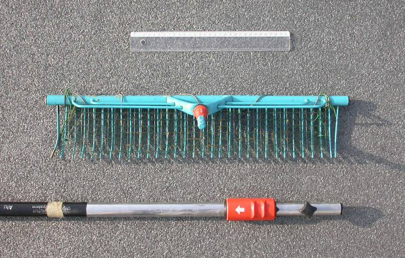
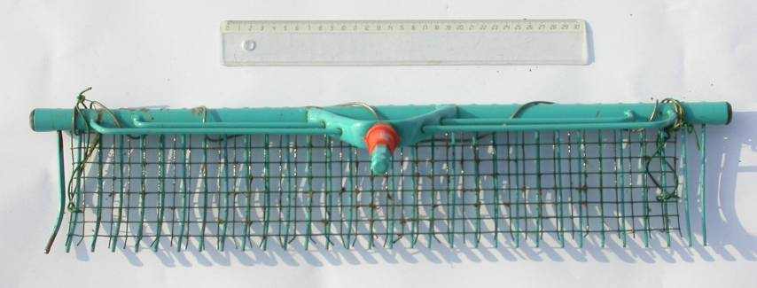
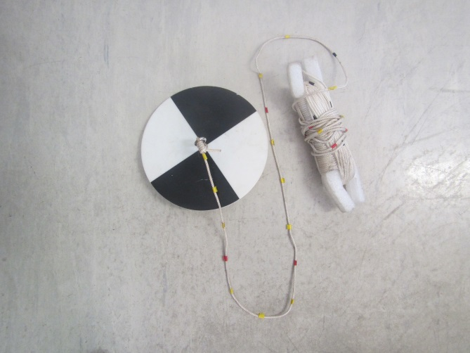

# Benodigdheden

Tabel \@ref(tab:Tabel1) geeft een overzicht van de benodigde apparatuur en materiaal; enkele daarvan specifiëren we hieronder.

| Benodigdheden                            |                                                                                                                  |
|:-----------------------------------------|:-----------------------------------------------------------------------------------------------------------------|
| $\square$ veldformulieren & handleiding  | $\square$ afgeprinte veldkaarten                                                                                 |
| $\square$ klembord & schrijfgerief       | $\square$ bamboestokken met gekleurd vlagje                                                                      |
| $\square$ gsm/smartphone                 | $\square$ loep                                                                                                   |
| $\square$ handcomputer/tablet            | $\square$ gps                                                                                                    |
| $\square$ lieslaarzen                    | $\square$ fototoestel                                                                                            |
| $\square$ waadpak                        | $\square$ verrekijker                                                                                            |
| $\square$ secchi-schijf                  | $\square$ rolmeter/plooimeter                                                                                    |
| $\square$ hersluitbare zakjes            | $\square$ alcoholstift                                                                                           |
| $\square$ waterdichte handschoenen       | $\square$ reddingvest                                                                                            |
| $\square$ ontsmettende zeep              | $\square$ reddingstouw                                                                                           |
| $\square$ vegetatiehark                  | $\square$ Flora van België (Lambinon et al., 1998) en/of andere determinatiewerken (Bijlage \@ref(determinatie)) |
| $\square$ bamboestok met schaalverdeling |                                                                                                                  |

: (#tab:Tabel1) Checklist veldmateriaal.

## Apparatuur

```{=html}
<!--
Opsomming van de apparatuur die nodig is en verwijzingen naar de `sip`'s (Standaard Instrument Procedure; `<protocol-code>-YYYY.NN`) indien die er zijn.
Indien geen specifiek `sip`'s voorhanden, illustreer de toegelaten apparatuur met foto's, geef het exacte type apparatuur mee, ...
-->
```
### Binoculaire stereomicroscoop en/of lichtmicroscoop

Planten die tijdens het veldwerk niet geïdentificeerd kunnen worden, kunnen in het labo met een binoculaire stereomicroscoop bekeken worden.
Met vergrotingen tot minimaal 80x kunnen detailkenmerken zoals stengelharen, sporenkapsels, ... bekeken worden.
Beschikbaarheid van een tegenlichtbron is hierbij aan te raden.
Voor sommige kenmerken kan best een lichtmicroscoop (100x en meer) gebruikt worden (stuifmeelkorrels, structuren op sporenkapsels, ...).

### Gps

Voor de positiebepaling van de opname is een afwijking van enkele meter geen groot probleem; een gewone gps met een nauwkeurigheid van 3 à 6 m is bijgevolg voldoende (dus hand/pols-gps, tablet-gps, smartphone-gps of veldcomputer).
Een RTK-gps is niet nodig voor dit type veldwerk, tenzij het een experimentele opzet zou betreffen die een hogere precisie vereist.

### Handcomputer of tablet

Voor de positiebepaling, de invoer van veldgegevens op terrein of de breedtebepaling van de waterloop kan gebruik gemaakt worden van een handcomputer of (rugged) tablet.
Het toestel zelf of de hoes errond dient geschikt te zijn voor veldomstandigheden (schokbestendig, stofvrij en (spat)waterdicht).

## Materiaal

```{=html}
<!--
Opsomming van gebruikte materialen.
Duidelijk aangeven welke materialen toelaatbaar zijn, welke volumes, afmetingen, materiaal, ... 
Vermeld bijvoorbeeld niet staalnamepotje, maar wel: vierkant flesje, volume 250 ml, gegradueerd, vervaardigd uit `PE`, met afsluitbare deksel uit `PP`.
-->
```
### Veldloep

Voor de determinatie van planten is een goede loep nodig.
De loep moet minstens 10x vergroten.
Met een loep van 20x kunnen detailkenmerken (kranswieren, sterrenkroos, ...) tijdens het veldwerk bekeken worden.

### Rolmeter

Om de breedte van de waterloop te meten is een oprolbaar meetlint nodig.
Zorg ook voor een pin met haak voor het vastmaken van het meetlint.
Als alternatief kan een afstandsmeter[^06_benodigdheden-1] of de SmartMeasure-applicatie[^06_benodigdheden-2] worden gebruikt
. De nauwkeurigheid en de praktische toepasbaarheid hiervan zijn nog te bepalen
.

[^06_benodigdheden-1]: Bijvoorbeeld <http://www.disto-afstandmeter.nl/disto_afstandsmeters/Disto%20X310>

[^06_benodigdheden-2]: <https://play.google.com/store/apps/details?id=kr.sira.measure&hl=nl>

### Vegetatiehark met telescopische steel

Een hark met telescopische steel maakt het mogelijk om waterplanten op te halen uit het water indien deze niet met de hand te bemonsteren zijn.
Hiervoor wordt een hark van ca.
50 cm breed op een tot 3,9 m uitschuifbare steel, bijv.
van het merk Gardena, gemonteerd (Figuur \@ref(fig:Figuur2)).
Op de hark wordt volièredraad (1 cm brede mazen) bevestigd met ijzerdraad om kleine en fijne waterplanten te kunnen bemonsteren (Figuur \@ref(fig:Figuur3)).
Op het vaste deel van de steel kan om de 20 cm kleefband bevestigd worden om de waterdiepte te bepalen.

```{r Figuur2, fig.cap = "Hark met uitschuifbare steel van het merk Gardena (foto Jo Packet)"}



```

```{r Figuur3, fig.cap = "Hark met volièredraad (foto Jo Packet)"}



```

### Hersluitbare zakjes en alcoholstift

Het gebeurt vaak dat identificatie in het veld niet mogelijk is en dat het plantenmateriaal naar het labo wordt gebracht voor verdere determinatie.
Voor het tijdelijk bewaren van plantenmateriaal wordt gebruik gemaakt van (diepvries-)zakjes met sluiting.
De zakjes worden gelabeld met alcoholstift of een papiertje met de in potlood aangebrachte veldcode wordt in het zakje gestoken.

### Secchi-schijf

Een secchi-schijf met een diameter van 20 cm (Figuur \@ref(fig:Figuur1)) wordt gebruikt om de secchi-diepte te bepalen.
Het touw waaraan de secchi-schijf is bevestigd, is voorzien van een maatverdeling om de diepte te kunnen bepalen.
Indien een secchi-schijf met andere diameter wordt gebruikt, dient dit vermeld te worden.

```{r Figuur1, fig.cap= "Secchi-schijf met maatverdeling op het touw"}



```

### Determinatiewerken

Relevante determinatiewerken worden in Bijlage \@ref(determinatie) per groep opgesomd.

## Reagentia en oplossingen (indien van toepassing)

Niet van toepassing.
