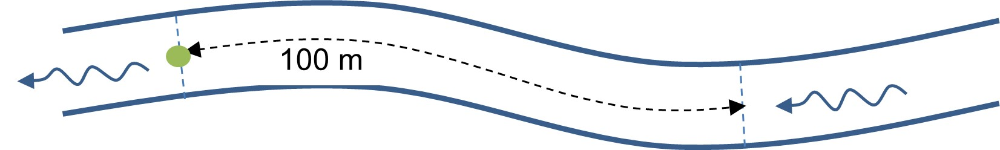
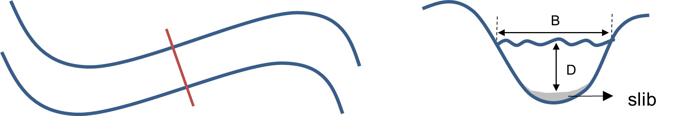

# Werkwijze

## Uitvoering

```{=html}
<!--
Gedetailleerde omschrijving van alle stappen die doorlopen moeten worden om het protocol uit te voeren.
Subtitels gebruiken om elke stap te omschrijven.
-->
```
### Lokaliseren en documenteren van veldlocatie

-   Vooraf worden de xy-coördinaten van het steekproefpunt (= meest stroomafwaartse punt van het segment, Figuur \@ref(fig:Figuur4)) en het eindpunt ingevoerd in een gps.
    Het eindpunt van het segment situeert zich 100 m stroomopwaarts van het steekproefpunt.

-   Navigeer met een gps naar de oever vlakbij het steekproefpunt.

-   Markeer eventueel het begin- en eindpunt met een bamboestok, voorzien van een gekleurde wimpel voor de zichtbaarheid.

```{r Figuur4, fig.cap = "Schematische voorstelling van het te inventariseren 100 m-segment, met aanduiding van het steekproefpunt (groene bol) en stroomrichting (blauwe pijl)"}



```

Aandachtspunten:

-   Indien het 100m-segment een overwelving bevat of beschaduwd is: noteer het percentage van het segment dat wordt ingenomen door de overwelving of schaduw.
    De bedekking van de vegetatie wordt ingeschat zoals in een normaal 100m-segment.

-   Indien de overwelving meer bedraagt dan 10 % of de schaduw meer dan 30 %, wordt het steekproefpunt in willekeurige richting (stroomop- of stroomafwaarts; munt opgooien) verlegd.
    Het vervangende steekproefpunt wordt ingemeten met de gps.

-   Wanneer de oorspronkelijke ligging van de bedding is gewijzigd, bijvoorbeeld ten gevolge van een hermeandering, wordt dit genoteerd op het veldformulier.
    De locatiekeuze van het segment dient dan zoveel mogelijk aan te sluiten bij de vroegere vindplaats van de sleutelsoorten.
    Ook in dit geval worden de gewijzigde xy-coördinaten op het veldformulier genoteerd.

-   Indien het steekproefpunt niet bereikbaar is, wordt dit genoteerd op het veldformulier en wordt dit steekproefpunt vervangen door het eerstvolgende reservepunt.

### Vegetatieopname (achterkant veldformulier; Bijlage \@ref(veldformulier))

-   De waterdiepte bepaalt de wijze van opname:

    -   door het water wadend in stroomopwaartse richting indien de waterdiepte dit toelaat;

    -   harkend vanuit het water, indien het centrale deel van de waterloop ondoorwaadbaar is, maar de zone nabij de oever wel doorwaadbaar is;

    -   harkend vanop de oever, indien het water te diep is; iedere 10 m wordt enkele keren geharkt; hierbij is het mogelijk dat het centrale deel van de waterloop niet bemonsterd kan worden;

    -   in diepere wateren kan met een kano, kajak of bootje geïnventariseerd worden.

-   Vertrek van het steekproefpunt; maak van hieruit een vegetatieopname van 100 m in stroomopwaartse richting.
    Hierbij wordt zig-zag-gewijs van de éne oever naar de andere oever gewaad om de volledige breedte van de waterloop te kunnen overzien.

#### Bedekking en groeivorm individuele soorten

-   Je kan het segment best tweemaal doorwaden, éénmaal stroomopwaarts om de soorten te noteren.
    Daarna worden de bedekkingen genoteerd met de bedekkingsschaal van Tabel \@ref(tab:Tabel2).
    Wanneer je stroomafwaarts terugkeert naar het beginpunt, kunnen de bedekkingen gecontroleerd worden en kunnen andere kenmerken (zie) \@ref(algstand)) genoteerd worden.

-   Enkel de soorten die met hun wortels **in** het water/de waterbodem staan bij **normale waterstand** worden genoteerd.
    Hierbij worden zowel helofyten (riet, lisdodde, grote egelskop, liesgras, witte waterkers, ...) als echte waterplanten (fonteinkruid, sterrekroos, waterranonkels, waterpest, vederkruid, ...) genoteerd.
    In de Grensmaas is de recent frequent geïnundeerde oever of de normale waterstand soms moeilijk te bepalen bij brede en geleidelijk hellende grindbanken.
    Bij twijfel worden enkel de soorten genoteerd die voorkomen op de grindbank tot maximaal één meter vanaf de waterlijn.

-   Indien identificatie op het terrein niet mogelijk is, worden de planten meegenomen in een hersluitbaar plastic zakje, voorzien van de locatiecode om deze later in het labo te kunnen determineren.
    De kolom 'coll' op het veldformulier wordt aangekruist of het volgnummer van het herbariumspecimen wordt hierin genoteerd.

-   De groeivorm wordt genoteerd wanneer deze afwijkt van deze die doorgaans wordt aangetroffen (zie lijst in Bijlage \@ref(groeivormen)).

-   Bij de schatting van de bedekking heeft het percentage bedekking voorrang op het aantal exemplaren.
    Eén grote boom of struik die in het water groeit en die ca.
    7% bedekt valt dus in de klasse 'laag-abundant' en niet in de klasse 'zelden'.

| Code   | Klasse        | Beschrijving                                 |
|:-------|:--------------|:---------------------------------------------|
| **z**  | zelden        | 1 - 3 exemplaren; nooit bedekkend            |
| **o**  | occasioneel   | meer exemplaren; nooit bedekkend; \< 1 %     |
| **f**  | frequent      | groot aantal exemplaren en 1 - 5 % bedekkend |
| **la** | laag-abundant | 5 - 25 %                                     |
| **a**  | abundant      | 25 - 50 %                                    |
| **cd** | codominant    | 50 - 75 %                                    |
| **d**  | dominant      | \>75 %                                       |

: (#tab:Tabel2) Bedekkingsschaal (Schneiders et al., 2004).

De bedekkingsschaal van Tabel \@ref(tab:Tabel2) gebruikt dezelfde terminologie als Tansley, maar wordt anders geïnterpreteerd dan de oorspronkelijke Tansley-schaal.
Door Schneiders et al. (2004) werd deze gecombineerde schaal naar voren geschoven als meest geschikte schaal voor waterloopopnames.
De schaal leunt onder de 5 % bedekking aan bij de interpretatie van Tansley en boven de 5 % bij Braun-Blanquet.
Deze schaal wordt momenteel ook toegepast bij de monitoring voor de KRW-kwaliteitsbepaling aan de hand van macrofyten in waterlopen.

#### Totale bedekking

De totale bedekking van alle planten die in het water staan -- zowel emergente, submerse als drijvende planten -- wordt genoteerd als loodrechte projectie op het wateroppervlak (procentueel).

#### Submerse vegetatie

De bedekking van submerse of ondergedoken waterplanten wordt als geheel ingeschat op een schaal van 0 tot 3 (Tabel \@ref(tab:Tabel3)).
De mate van submerse vegetatieontwikkeling is een apart beoordelingscriterium voor de KRW.
Het geeft inzicht in een aantal drukken en in het functioneren van het systeem.
Onderstaande vegetatie wordt inbegrepen in de submerse vegetatie (gebaseerd op Denys, 2011):

-   alle in de bodem wortelende vaatplanten met onderwaterbladeren, incl.
    hun stengels; ook de ondergedoken delen van kleine egelskop;

-   hoewel niet wortelend, worden ook *Ceratophyllum* spp.
    meegenomen, gezien hoornblad doorgaans met de bebladerde stengel enigszins in de bodem is verankerd;

-   de blijvend ondergedoken bladeren van *Nuphar* en *Sagittaria*; alle kranswieren en op de bodem groeiende mossen;

-   draadwieren (incl. darmwier en waternetje) worden ook bij de ondergedoken vegetatie gerekend.

-   Soorten die verschillende groeivormen kunnen aannemen, worden naargelang hun verschijningsvorm mogelijk gerekend tot de submerse vegetatie (bijlage \@ref(groeivormen)).
    Bij morfologisch verschillende ondergedoken bladeren, worden ze bij de submerse vegetatie gerekend.
    Voorbeelden hiervan zijn *Myriophyllum aquaticum*, *Hippuris vulgaris* en *Sagittaria sagittifolia*.

Worden niet tot 'submerse vegetatie' gerekend:

-   niet-fotosynthethische organismen (zgn. rioolschimmel in waterlopen) en wortels;

-   eendekrozen (*Lemna*, *Spirodela*, ...) en andere drijvende planten met aan de lucht blootgestelde bladeren (*Azolla*, *Hydrocharis*, *Stratiotes*, *Ricciocarpos*, *Salvinia*, ...);

-   wortelende planten met aan de lucht blootgestelde bladeren (helofyten en nymphaeïden, incl. hun bladstelen, stengels en wortels in het water; incl. *Potamogeton natans*, ongeacht de eventuele aanwezigheid van fyllodiën); alle drijf- of luchtbladeren, ook indien deze zich onder het wateroppervlak bevinden;

-   ondergedoken maar doorgaans nabij het wateroppervlak zwevende planten (*Lemna trisulca*, *Riccia fluitans*, *Utricularia* spp.);

-   vegetatieve grassen die als gevolg van een plotse waterpeilstijging submers komen te liggen.

Het percentage van het 100m-segment dat vertegenwoordigd wordt door elke submerse vegetatieontwikkelingsklasse wordt genoteerd met een nauwkeurigheid van (5 à) 10 % (Tabel \@ref(tab:Tabel3)).

| Code | Beschrijving                                                                                                                                                                                                                                                           |
|:-----|:-----------------------------------------------------------------------------------------------------------------------------------------------------------------------------------------------------------------------------------------------------------------------|
| 0    | geen ondergedoken vegetatie                                                                                                                                                                                                                                            |
| 1    | planten schaars, weinig harkmonsters leveren planten op of veel harkmonsters met enkele planten op hark                                                                                                                                                                |
| 2    | planten frequent tot talrijk maar niet de gehele waterkolom opvullend; veel harkmonsters leveren planten op met meerdere planten op hark en de submerse vegetatie vormt zelden of nooit een belemmering voor de doortocht (van een bootje of al wadend)                |
| 3    | waterkolom grotendeels tot geheel opgevuld; alle harkmonsters leveren planten op waarbij de hark vol planten hangt, planten groeien tot aan het wateroppervlak in grootste deel van het segment of draadwiermassa's bedekken nagenoeg de gehele bodem of het oppervlak |

: (#tab:Tabel3) Klassen van submerse vegetatieontwikkeling (Schneiders et al., 2004).

#### Vegetatievlekken van het habitattype 3260

-   Tijdens het stroomopwaarts waden wordt het aantal vegetatievlekken van sleutelsoorten per grootteklasse geturfd.
    Zo is het nadien eenvoudiger om hiervan de som te bepalen.

-   Er is geen minimum-oppervlakte om van een vegetatievlek te kunnen spreken.
    Wanneer de sleutelsoorten zeer schaars aanwezig zijn en er slechts enkele exemplaren worden aangetroffen, wordt dit als een vegetatievlek van de laagste grootteklasse gerekend.

-   Op basis van de genoteerde vegetatievlekken wordt de totale oppervlakte van vegetatievlekken en de oppervlakte van de grootste vegetatievlek ingeschat.

-   Ook wanneer er geen sleutelsoorten van het habitattype worden aangetroffen, wordt het veldformulier volledig ingevuld, maar wordt er aangeduid dat het habitattype afwezig is.

#### Bedekking verstoringsindicatoren

Het percentage verstoringsindicatoren (helofyten, eutrofiëringsindicatoren en invasieve exoten, zie Bijlage \@ref(eutr) en Bijlage \@ref(invasief)) wordt ingeschat als oppervlakte-percentage, oftewel de projectie t.o.v. het wateroppervlak.

### Algemene standplaatskenmerken {#algstand}

De algemene kenmerken zijn gebaseerd op veldformulieren opgemaakt voor de KRW-macrofytenmonitoring (Leyssen et al., 2005; Leyssen et al., 2007; Schneiders et al., 2004), veldprotocols voor de hydromorfologiemonitoring (VMM, 2010) en de 'River Habitat Survey' (Environment Agency, 2003).
Voor definities van de kenmerken wordt verwezen naar \@ref(definities-en-afkortingen).

De meeste kenmerken worden op het veldformulier geregistreerd door keuzevakjes aan te kruisen; er zijn 2 typen van keuzemogelijkheden:

-   $\square$ (selectievakje): meerdere keuzes zijn mogelijk;
-   $\circ$ (keuzerondje): er is slechts één keuze mogelijk.

#### Waterpeil

Een afwijkend waterpeil wordt genoteerd.
Bij een uitzonderlijk hoog waterpeil wordt afgeraden om een vegetatieopname te maken, enerzijds omwille van veiligheid en anderzijds vanwege het beperkt doorzicht dat meestal gepaard gaat met een uitzonderlijk hoog waterpeil.

#### Stroomsnelheid

De stroomsnelheid wordt op één plaats gemeten voor een algemene kwantitatieve karakterisatie van de stroomsnelheid.
Deze wordt gemeten op dezelfde plaats als de secchi-bepaling (zie verder).
Kies een nagenoeg recht stuk van de waterloop uit, met min of meer horizontale stroming (parallel met oeverlijn).
Submerse vegetatie, grote stenen, vistrappen en andere obstakels moeten vermeden worden omdat deze turbulentie veroorzaken.

De meting wordt uitgevoerd op de helft van de waterdiepte.
Bijv.: bij een waterdiepte van 1 m, wordt de meting op 0,5 m diepte uitgevoerd.
Bij zeer diepe waterlopen wordt de stroomsnelheidsmeting op ca.
1 m diepte uitgevoerd, omdat de sonde niet dieper geplaatst kan worden en uit veiligheidsoverwegingen.
Indien de meting op een andere diepte dan de helft van de waterdiepte wordt uitgevoerd, wordt dit op het veldformulier genoteerd.
De keuze van waterdiepte voor de stroomsnelheidsbepaling dient bij het ontwikkelen van het deelprotocol (sfp-118) verder geëvalueerd te worden, o.a.
gebaseerd op (Hartong & Termes, 2009; Osté et al., 2013; Stone et al., 2012; West Virginia Department of Environmental Protection, 2018).

#### Artificiële structuren

Indien er een verharde, ondoorgroeibare waterbodem aanwezig is (bodemplaat of bodemval), wordt de lengte van het segment met bodemverharding genoteerd.
Indien er een overwelving aanwezig is, wordt dit eveneens genoteerd en worden er foto's van genomen.

#### Schaduw

Schaduw wordt ingeschat als de procentuele bedekking van schaduw op het wateroppervlak, veroorzaakt door houtigen groter dan 2 m.
Het betreft de loodrechte projectie op het wateroppervlak.

Eén boom die een groot deel van het segment beschaduwt (bijv. 10 %) en die op de oever wortelt, telt mee in het percentage schaduw, maar wordt niet in de vegetatieopname vermeld.
Wanneer deze éne boom in het water staat, telt deze ook mee voor het percentage schaduw en wordt ze vermeld in de vegetatieopname.

#### Dwarsprofiel

Voor de bepaling van de breedte, diepte en slibdikte wordt een dwarsprofiel (Figuur \@ref(fig:Figuur5)) van het segment beschouwd.
In meanderende waterlopen gebeuren deze metingen in het deel tussen de twee meanderbochten.
De breedte van het wateroppervlak wordt bepaald met behulp van een laserafstandsmeter, een smartphoneapplicatie, een rol- of plooimeter.
Voor de breedte van de Grensmaas wordt enkel de breedte van de Vlaamse zijde genoteerd; indien mogelijk ter plaatse ingeschat of via een zomer-orthofoto.
Een plooimeter van 2 m of de maataanduiding van de telescopische steel wordt gebruikt voor de bepaling van de waterdiepte.
De slibdikte wordt bepaald door de telescopische steel zachtjes in de bodem te prikken tot er een hogere weerstand is van het onderliggende bodemsubstraat.
De sliblaag is soms niet vast te stellen indien een meting te gevaarlijk is.
Er wordt dan aangeduid dat er een sliblaag aanwezig is, maar dat de meting onmogelijk is.
Indien mogelijk wordt aangegeven dat de slibdikte groter is dan .....
m.

```{r Figuur5, fig.cap= "Situering doorsnee dwarsprofiel (rood, links) en op te nemen kenmerken van het dwarsprofiel (rechts)"}



```

#### Grof organisch materiaal

De aanwezigheid van bladeren, dood plantaardig materiaal en dood hout in de bedding van de waterloop wordt ingeschat in verschillende klassen: bladeren of dood plantaardig materiaal; twijgjes (\< 3 cm doorsnede); takken (\< 30 cm doorsnede) en grote takken of boomstammen (\> 30 cm).
De aanwezigheid van één enkel blaadje of twijgje is niet relevant voor de opname; bijgevolg geldt voor deze laagste twee klassen een minimum van 1 % bedekking.
Voor takken en boomstammen is de aanwezigheid van minstens 1 exemplaar voldoende.

#### Helderheid waterkolom

Indien er geen bodemzicht is, wordt de secchi-diepte bepaald.
De schijf wordt langzaam in het water gelaten en de diepte waarop het onderscheid tussen de witte en de zwarte vlakken niet meer zichtbaar is, wordt afgelezen van de maatverdeling op het touw.
Dit wordt enkele malen herhaald.
Indien de schijf tot op de bodem zichtbaar is, wordt 'bodemzicht' aangevinkt.
De meting van de secchi-diepte dient in het midden van de waterloop uitgevoerd te worden ter hoogte van de plaats waar ook het dwarsprofiel wordt opgemeten.
Bij te grote diepte, kan de secchi-diepte bepaald worden vanop een brug.
Wanneer door stroming de secchi-schijf sterk afdrijft en de schijf niet loodrecht onder het wateroppervlak komt te hangen, kan de secchi-schijf aan de onderzijde verzwaard worden.
Zie ook deelprotocol (sfp-113).

#### Dominant oeverprofiel

Het dominante oeverprofiel wordt per oeverzijde genoteerd.
In vergelijking met de uitgebreide oeverprofieltypen van RHS (2003) en VMM (2010), worden er slechts 3 grote categorieën onderscheiden: rechte of holle oevers (± 90°); sterk hellende oevers ($\geq$ 45°) en zwak hellende oevers (\< 45°)[^07_werkwijze-1].
Er wordt genoteerd of het om een (overwegend) natuurlijk of een kunstmatig profiel gaat.
Elke kunstmatig aangebrachte vorm van oeverversteviging die tot doel heeft de oever of de rand van de plas-draszone te vrijwaren van erosie en op die manier de stroombaan te fixeren, wordt beschouwd als 'kunstmatig' (VMM, 2010).

[^07_werkwijze-1]: Om de graden van het oeverprofiel in te schatten kan volgende app gebruikt worden: (<https://play.google.com/store/apps/details?id=kr.sira.protractor&hl=nl>)

Voorbeeld 1: Onverharde verticale of holle oevers die door erosie ontstaan, worden gerekend tot natuurlijke rechte oevers.

Voorbeeld 2: Om de oever te stabiliseren werd oeververdediging aangebracht onder de vorm van een palenrij onder de hoogwaterlijn.
Op het terrein is deze niet steeds zichtbaar en is deze soms na verloop van tijd overgroeid of verzakt.
Dit wordt beschouwd als een kunstmatig profiel.

#### Recent beheer

Dit dient enkel ingevuld te worden indien dit beheer nog duidelijk op terrein zichtbaar is (bv. maaisel op oever, ...).

## Registratie en bewaring van resultaten

```{=html}
<!--
Opsomming van alle resultaten die bekomen worden na de uitvoering van het protocol en hoe die resultaten geregistreerd, bewaard of opgeslagen moeten worden.
Voor metingen of observaties: verwijs naar invulformulier (met versienummer; invulformulier toevoegen in bijlage; eventueel bepaalde zaken van invulformulier verduidelijken) en/of naar apparatuur en/of softwareprogramma indien gegevens digitaal worden ingevoerd (verwijs naar `sip` (standaard instrument protocol, `<protocol-code>-YYYY.NN`) indien beschikbaar; indien geen sip beschikbaar, geef de nodige instructies om gegevens op gepaste wijzen in te kunnen geven).
Voor staalnames: geef aan hoe de stalen bewaard, gelabeld en vervoerd moeten worden.
Geef aan of de stalen voorbehandeld moeten worden.
Voor digitale foto’s en/of andere digitale bestanden: geef aan hoe en waar deze bestanden moeten worden opgeslagen.
Geef eventueel aan welke bestandsnamen aan de bestanden moeten gegeven worden.
-->
```
### Invoer veldgegevens

De invoer van veldgegevens gebeurt digitaal op het terrein met een (rugged) tablet in INBOVEG (Survey = HT3260) of met een Excel- of Google spreadsheet-app (als offline alternatief) of analoog op een veldformulier (Bijlage \@ref(veldformulier)).

### Determinaties

Soorten die in het veld niet op naam gebracht kunnen worden, kunnen tot hooguit één week gekoeld bewaard worden.
Ze kunnen in het labo op naam gebracht worden met een loep, stereomicroscoop of lichtmicroscoop en relevante determinatiewerken (Bijlage \@ref(determinatie)).
Indien relevant, kunnen foto's genomen worden.
De geïdentificeerde specimen worden bewaard in een herbarium.

### Opslag van foto's

-   De foto's worden chronologisch per datum in mappen bewaard, waarbij de locatiecode en de datum in de map- of bestandsnaam wordt vermeld
