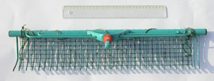
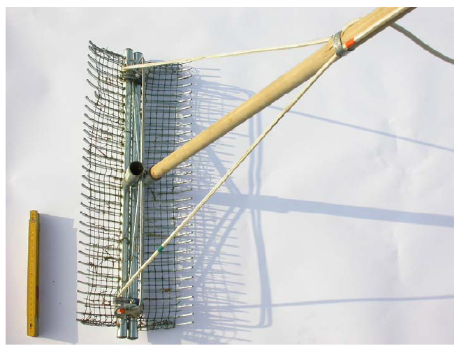

# Benodigdheden

Onderstaand veldmateriaal dient tijdens het veldwerk beschikbaar te zijn (Tabel \@ref(tab:Tabel1) ); enkele daarvan specifiëren we.

| Benodigdheden                                                                     |
|:----------------------------------------------------------------------------------|
| $\square$ veldformulieren en relevante protocollen                                |
| $\square$ documentatie van de veldlocatie om deze te kunnen lokaliseren           |
| $\square$ klembord, potlood, slijper                                              |
| $\square$ auto-gps, tablet, smartphone, fototoestel, handcomputer                 |
| $\square$ laarzen, lieslaarzen, waadpak (site-afhankelijk)                        |
| $\square$ hersluitbare zakjes, alcoholstift of papier en potlood                  |
| $\square$ vegetatiehark of dreghark bij diepe plassen                             |
| $\square$ boot met zwemvesten, \...(site-afhankelijk)                             |
| $\square$ determinatiewerken, loep                                                |
| $\square$ waterdichte handschoenen, ontsmettende zeep, reddingsvest, reddingstouw |
| $\square$ secchi-schijf: zie materiaal van deelprotocol sfp-113                   |
| $\square$ stokken voorzien van gekleurde wimpel                                   |

: (#tab:Tabel1) Checklist veldmateriaal

## Apparatuur

```{=html}
<!--
Opsomming van de apparatuur die nodig is en verwijzingen naar de `sip`'s (Standaard Instrument Procedure; `<protocol-code>-YYYY.NN`) indien die er zijn.
Indien geen specifiek `sip`'s voorhanden, illustreer de toegelaten apparatuur met foto's, geef het exacte type apparatuur mee, ...
-->
```
### Binoculaire stereomicroscoop en/of lichtmicroscoop

Planten die tijdens het veldwerk niet geïdentificeerd kunnen worden, kunnen in het labo met een binoculaire stereomicroscoop bekeken worden.
Met vergrotingen tot minimaal 80x kunnen detailkenmerken zoals stengelharen, sporenkapsels, ... bekeken worden.
Beschikbaarheid van een tegenlichtbron is hierbij aan te raden.
Voor sommige kenmerken kan een lichtmicroscoop (100x en meer) gebruikt worden (stuifmeelkorrels, structuren op sporenkapsels, ...).

### standaard GPS

Voor de positiebepaling van de opname is een afwijking van enkele meter geen groot probleem; een gewone gps met een nauwkeurigheid van 3 à 6 m is bijgevolg voldoende (dus hand/pols-GPS, tablet-GPS, smartphone-GPS of veldcomputer).
Een RTK-GPS is niet nodig voor dit type veldwerk.

### Handcomputer, tablet of smartphone

Voor de positiebepaling of de invoer van veldgegevens op terrein kan gebruik gemaakt worden van een handcomputer, (rugged) tablet of smartphone.
Het toestel zelf of de hoes errond dient geschikt te zijn voor veldomstandigheden (schokbestendig, stofvrij en (spat)waterdicht).

## Materiaal

```{=html}
<!--
Opsomming van gebruikte materialen.
Duidelijk aangeven welke materialen toelaatbaar zijn, welke volumes, afmetingen, materiaal, ... 
Vermeld bijvoorbeeld niet staalnamepotje, maar wel: vierkant flesje, volume 250 ml, gegradueerd, vervaardigd uit `PE`, met afsluitbare deksel uit `PP`.
-->
```
### Veldloep

Voor de determinatie van planten is een goede loep nodig.
De loep moet minstens 10x vergroten.
Met een loep van 20x kunnen detailkenmerken (kranswieren, sterrenkroos, ...) tijdens het veldwerk bekeken worden.

### Vegetatiehark en dreghark

Een hark met telescopische steel maakt het mogelijk om waterplanten op te halen uit het water indien deze niet met de hand te bemonsteren zijn.
Hiervoor wordt een hark van ca.
50 cm breed op een tot 3,9 m uitschuifbare steel, bijv.
van het merk Gardena, gemonteerd (Figuur \@ref(fig:Figuur1)).
Op de hark wordt volièredraad (1 cm brede mazen) bevestigd met ijzerdraad om kleine en fijne waterplanten te kunnen bemonsteren (Figuur \@ref(fig:Figuur2)).
Op het vaste deel van de steel kan om de 20 cm kleefband bevestigd worden om de waterdiepte te bepalen.

{width="3.09375in" height="1.9791666666666667in"}

{width="3.1458333333333335in" height="1.1979166666666667in"}

In diepe delen van plassen wordt de vegetatieopname vanop een boot uitgevoerd.
Een dreghark (figuur 3) wordt gebruikt om de aanwezige macrofyten puntsgewijs langsheen de transecten te bemonsteren.

{width="3.0722659667541556in" height="2.315625546806649in"}

### Hersluitbare zakjes

Soms is identificatie in het veld niet mogelijk en wordt het plantenmateriaal naar het labo gebracht voor verdere determinatie.
Voor het tijdelijk bewaren van plantenmateriaal wordt gebruik gemaakt van (diepvries-)zakjes met sluiting.
De zakjes worden gelabeld met alcoholstift of voorzien van een papier met veldcode en datum (in potlood aangebracht).

### stokken met wimpel

Stokken (type bamboestokken) van ca.
1,5 m hoogte, voorzien van een felgekleurde wimpel worden gebruikt om de eindpunten van de transecten tijdelijk te markeren.

## Reagentia en oplossingen (indien van toepassing)

```{=html}
<!--
Een opsomming van reagentia, welke zuiverheid, volume, veiligheidsvoorschriften.
Bijvoorbeeld. Zwavelzuur (`H2SO4`), geconcentreerd (96%), pro analyse en veiligheidsinfo (sterk zuur, bijtend, gebruik handschoenen, bril en masker bij gebruik)
Een opsomming van oplossingen, welke zuiverheid, volume, veiligheidsvoorschriften.
Indien deze oplossingen zelf worden bereid, vermeld dan ook de bereidingswijze.
bijvoorbeeld: Zwavelzuur `1M`: verdun zwavelzuur geconcentreerd 18 maal met `ultrapuur` water.
Opgelet: giet altijd zwavelzuur bij water en nooit omgekeerd!
-->
```
Niet van toepassing.
