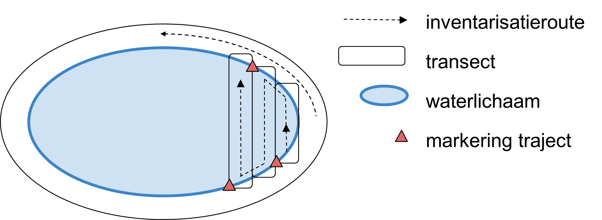
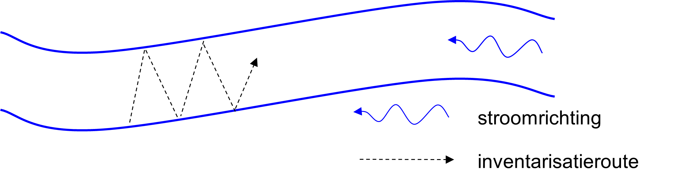

# Werkwijze

## Uitvoering

```{=html}
<!--
Gedetailleerde omschrijving van alle stappen die doorlopen moeten worden om het protocol uit te voeren.
Subtitels gebruiken om elke stap te omschrijven.
-->
```
### Voorbereiding terreinwerk

-   vooraf worden de XY-coördinaten van de veldlocatie ingevoerd in een standaard GPS of in een smartphone-applicatie;

-   navigeer met behulp van een standaard GPS naar de oever van de veldlocatie.

-   de soort is het gemakkelijkst te herkennen en op te sporen wanneer deze in bloei is; het terreinwerk wordt bijgevolg idealiter uitgevoerd tijdens het hoogtepunt van de bloeiperiode, in juni en juli, maar kan naargelang de weersomstandigheden ook al vroeger of later in het veldseizoen plaatsvinden.

### Zoeken naar *Luronium natans* (naar Van Landuyt 2014)

-   De waterdiepte bepaalt of bij de opname een boot vereist is of niet; de werkwijze is in beide gevallen gelijkaardig.

-   Bij het speuren naar rozetten van *Luronium natans* wordt de groeiplaats doorzocht door deze systematisch af te lopen in transecten van ongeveer 3 à 4 meter breed[^07_werkwijze-1].
    De (bamboe)stokken, voorzien van een gekleurde wimpel, worden hierbij gebruikt om de transecten te begrenzen.

    -   bij opname in een plas (Figuur \@ref(fig:Figuur4)), wordt eerst de oever afgespeurd; daarna wordt het open water in transecten doorwaad.
        Diepere delen kunnen puntsgewijs met een dreghark vanuit een boot worden gecontroleerd, afhankelijk van de veldsituatie.

    -   bij opname in een waterloop (Figuur \@ref(fig:Figuur5)) wordt tegen de stroming in gewaad, zodat omgewoeld substraat het zicht niet belemmert.
        Hierbij wordt zig-zag-gewijs van de éne oever naar de andere oever gewaad om de volledige breedte van de waterloop te kunnen overzien.

[^07_werkwijze-1]: Door Van Landuyt (2014) worden transecten van 5 meter breedte aangeraden, maar deze breedte is in aquatische omgeving moeilijk te overzien; er wordt bijgevolg een smaller transect voorzien.

{width="6in"}

{width="6in"}

-   Indien *Luronium natans* wordt waargenomen, wordt deze *Luronium*-vlek als punt met een GPS of de Collector-app ingevoerd (feature class: InvPatchLuronium_20xx). Van elke vlek wordt het aantal rozetten in klassen ingeschat. Ook de oppervlakte die de rozetten innemen wordt ingeschat in klassen (zie Tabel \@ref(tab:Tabel2)). Indien slechts enkele schaars verspreide rozetten in een zone wordt waargenomen, zal de oppervlakteklasse van *Luronium* daar laag zijn, terwijl de effectieve contour van de vlek er groter is.

| code | aantal rozetten | oppervlakte      |
|:-----|:----------------|:-----------------|
| A    | 1               | \< 1 dm²         |
| B    | 2 - 5           | 1 dm² - 0,5 m²   |
| C    | 6 - 25          | 0,5 - 1 m²       |
| D    | 26 - 50         | 1 - 5 m²         |
| E    | 51 - 100        | 5 - 25 m²        |
| F    | 101 - 500       | 25 - 50 m²       |
| G    | 501 - 1000      | 50 - 500 m²      |
| H~a~ | 1001 - 2000     | H: 500 - 5000 m² |
| H~b~ | 2001 - 5000     |                  |

: (#tab:Tabel2) Klassen voor inschatting aantal rozetten en oppervlakte die de rozetten innemen (klassegrenzen gebaseerd op Van Landuyt (2014) en Mergeay et al. (2020))

-   Van grotere *Luronium*-vlekken worden de contouren ingetekend op kaart (analoog of digitaal).

-   Indien de opname met meerdere personen wordt uitgevoerd, kan één persoon de *Luronium*-vlekken met een bamboestok markeren en de andere persoon deze met GPS inmeten.
    Of er kan samengewerkt worden om bredere transecten te doorwaden door deze samen op één lijn af te stappen.

-   De aanwezigheid van overige soorten in het waterlichaam kan op het veldformulier genoteerd worden of via een audiofragment geregistreerd.
    Dit is echter niet vereist voor de LSVI-bepaling van *Luronium natans* (Lommaert et al. 2020).

### Secchi-diepte bepalen en registratie van overige kenmerken

Voor de technische uitvoering van de secchi-diepte-bepaling wordt verwezen naar protocol [sfp-113 2023.04](../2023.04/index.html).
De secchi-diepte wordt op twee plaatsen bepaald: één bepaling voor het volledige waterlichaam (in het midden van de waterloop of plas) en één in een representatieve zone van de *Luronium natans*-populatie of op de plek waar de soort vroeger is waargenomen.
Bij voorkeur wordt de secchi-diepte bepaald in een vegetatieloze of vegetatiearme zone.
De waterdiepte waar de secchi-diepte werd bepaald, wordt eveneens genoteerd.

Vervolgens worden de overige kenmerken geregistreerd op het veldformulier (zie volgende paragraaf).

## Registratie en bewaring van resultaten

```{=html}
<!--
Opsomming van alle resultaten die bekomen worden na de uitvoering van het protocol en hoe die resultaten geregistreerd, bewaard of opgeslagen moeten worden.
Voor metingen of observaties: verwijs naar invulformulier (met versienummer; invulformulier toevoegen in bijlage; eventueel bepaalde zaken van invulformulier verduidelijken) en/of naar apparatuur en/of softwareprogramma indien gegevens digitaal worden ingevoerd (verwijs naar `sip` (standaard instrument protocol, `<protocol-code>-YYYY.NN`) indien beschikbaar; indien geen sip beschikbaar, geef de nodige instructies om gegevens op gepaste wijzen in te kunnen geven).
Voor staalnames: geef aan hoe de stalen bewaard, gelabeld en vervoerd moeten worden.
Geef aan of de stalen voorbehandeld moeten worden.
Voor digitale foto’s en/of andere digitale bestanden: geef aan hoe en waar deze bestanden moeten worden opgeslagen.
Geef eventueel aan welke bestandsnamen aan de bestanden moeten gegeven worden.
-->
```
### Registratie van resultaten in veldformulier

Het veldformulier kan ingedeeld worden in 3 onderdelen ( Bijlage \@ref(veldformulier)), waarvan het eerste deel de kopgegevens bevat.
De overige 2 hebben betrekking op twee schaalniveau's waarvan kenmerken worden genoteerd: het waterlichaam en de groeiplaats van *Luronium*.
Enkel de niet voor de hand liggende kenmerken worden hieronder toegelicht.

**deel 1 - kopgegevens**: locatiecode (afgekort zoals in Bijlage \@ref(veldlocaties)), veldmedewerker, datum, \...

**deel 2 - schaalniveau waterlichaam**

-   dynamische processen die zorgen voor pionierscondities: zowel natuurlijke (windwerking, overstroming) als menselijke ingrepen (peilbeheer) worden hieronder gerekend.
    Indicaties van windwerking in plassen zijn: waterbeweging bij sterke wind, golfwerking, opstapeling van organisch materiaal in de luwe zones, indicaties van oevererosie door waterbeweging.
    Peilbeheer kan in het veld herkend worden bij aanwezigheid van (regelbare) stuwen of andere constructies die aan- of afvoer van water mogelijk maken.
    Bij aanwezigheid van meerdere dynamische processen wordt de frequentie van het proces dat het frequentst plaatsvindt genoteerd.
    De vaststelling van dynamische processen is bij een éénmalig veldbezoek soms moeilijk in te schatten.
    Eventueel kunnen orthofoto's van voorafgaande jaren of een gesprek met de beheerder duidelijkheid bieden.

-   oeverprofiel (% oever met volgend profiel): inschatting van het percentage van de omtrek van het waterlichaam voor de verschillende oeverhellings-klassen: zeer zwak hellend (\< 15°); zwak hellend (15°-45°); steil (45°-90°) en recht (90°).
    De oeverhelling van waterlijn tot daarboven bij normaal waterpeil wordt hierbij beoogd; niet het onderwaterprofiel.

-   waterdiepte: ook bij uitzonderlijk hoge of lage waterstand wordt de huidige waterstand genoteerd.
    Op deze plek wordt eveneens de secchi-diepte bepaald.

-   slib en org.
    mat.: zowel de dikte van de sliblaag als van het grof organisch materiaal wordt ingeschat.
    Hierbij wordt dikte van een representatief meetpunt of de gemiddelde dikte beoogd, niet de extreme metingen.

-   PVI: het percentage van de waterkolom dat opgevuld is met macrofyten.
    Dit wordt bepaald in een representatieve zone van het waterlichaam of ingeschat voor het volledige watervolume.

-   beschaduwing: loodrechte projectie van bomen en struiken op het wateroppervlak;

-   hogere vegetatie: het percentage vegetatie hoger dan *Luronium natans* wordt genoteerd om competitie in te schatten.
    Afhankelijk van de in het veld vastgestelde dominante groeivorm van *Luronium*, worden hieronder niet enkel helofyten, maar ook submerse vegetatie of een kroosdek gerekend (bv. bij isoëtide groeivorm).

-   verstoringsindicatoren (achterkant veldformulier):

    -   de procentuele bedekking van alle verzurings-, eurtofiëringsindicatoren en invasieve soorten van de hele plas of waterloop wordt aan de rechterkant van het formulier genoteerd;

    -   het voorkomen wordt per soort aangekruist in de vakjes aan de linkerzijde;

    -   de lijst van verstoringsindicatoren stemt overeen met deze voor de LSVI-bepaling van habitattypen 3130 en 3260 (Oosterlynck et al. 2020).

    -   de eutrofiëringsindicatoren zijn verschillend voor plassen (habitattype 3130) en waterlopen (habitattype 3260); dit wordt aangeduid met 'P(las)' of 'W(aterloop)'.
        Indien leeg geldt dit voor beide typen.
        Enkel de relevante verstoringsindicatoren tellen mee voor de inschatting van het percentage eutofiëringsindicatoren.

-   overige soorten (achterkant veldformulier): een soortenlijst van het waterlichaam kan toegevoegd worden, dit is echter niet vereist voor de LSVI-bepaling van *Luronium.*

**deel 3 - schaalniveau populatie** (onderzijde voorkant veldformulier); delen hieronder gemarkeerd met \* worden niet ingevuld bij afwezigheid van *Luronium natans*, deze met (\*) enkel als de vroegere vindplaats van *Luronium natans* gekend is.

-   waterdiepte(\*), PVI(\*), beschaduwing(\*), hogere vegetatie(\*): zie hoger; bij meerdere *Luronium*-vlekken wordt een representatieve vlek uitgekozen voor de meting van de water- en secchi-diepte.

-   vitaliteit\*: kruis aan: bloei, zaadvorming en/of uitlopers aanwezig (foto's: zie Lansdown & Wade 2003);

-   morfologische kenmerken\*: kruis aan welk type bladeren aanwezig zijn: lijnvormige ondergedoken bladeren, drijfbladen en/of terrestrische bladeren van de landvorm (voor foto's: zie Lansdown & Wade 2003 en Lucassen et al. 2007);

-   aantal en oppervlakte\*:

    -   wordt als klasse per afzonderlijke *Luronium*-vlek ingeschat met codes A-Hb (Tabel \@ref(tab:Tabel2));

    -   onderaan (som) wordt voor het volledige waterlichaam het aantal rozetten en oppervlakte in dezelfde klassen ingeschat;

    -   betrouwbaarheid inschatting van aantal rozetten per waterlichaam: goed (valt zeker in deze klasse), matig (valt mogelijk in deze klasse of is aan klasse verkeerd ingeschat) of slecht (mogelijk twee klassen verkeerd ingeschat).

### Registratie van resultaten in Recorder

Voor elke locatie worden op het terrein de veldgegevens analoog of digitaal genoteerd op het veldformulier (Bijlage \@ref(veldformulier)).
Afwijkingen van de beschreven werkwijze worden eveneens genoteerd bij opmerkingen.
Na het veldseizoen worden de gegevens ingevoerd of geïmporteerd in Recorder (Survey: *Luronium natans* standplaatsonderzoek).

### Opslag van foto's

Opslag van foto's op google drive met aanduiding van opnamedatum, code van veldlocatie en watervlakkencode (Leyssen et al. 2020; <http://www.geopunt.be/catalogus/datasetfolder/61c4245b-a177-4fe8-a5cc-455475d7b40f> ) of naam waterloop (volgens de Vlaamse Hydrografische Atlas; <https://www.vmm.be/data/vlaamse-hydrografische-atlas>)
