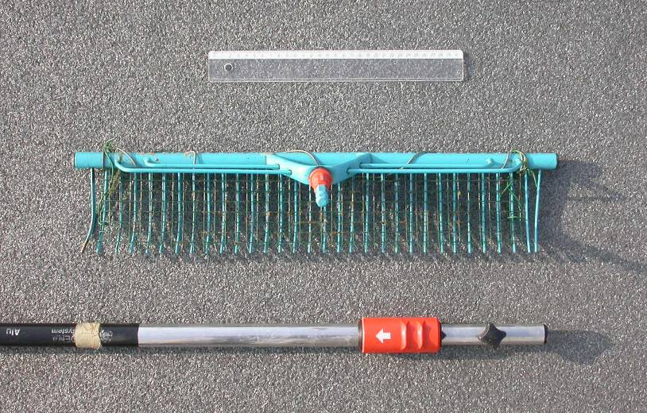

# Benodigdheden

```{=html}
<!--
Opsomming van benodigd materiaal, apparatuur, reagentia,...
-->
```

Tabel \@ref(tab:checklist) geeft een overzicht van de benodigde apparatuur en materiaal dat tijdens het veldwerk wordt gebruikt; enkele daarvan specifiëren we hieronder.

```{r checklist}
df <- data.frame(
  Item = c(
    "Veldformulier en handleiding",
    "Afgeprinte veldkaarten",
    "Schrijfgerief: papier en potlood, (alcohol)stift",
    "Klembord",
    "GSM/Smartphone (en/of handcomputer/tablet of gps; zie verder)",
    "Waterbestendig fototoestel of fototoestel met waterdichte behuizing",
    "Lieslaarzen",
    "Waadpak (zomer-/winterwaadpak)",
    "Loep",
    "Verrekijker",
    "Secchi-schijf",
    "Plooimeter",
    "Hersluitbare zakjes",
    "Waterdichte handschoenen",
    "Ontsmettende zeep of handgel",
    "Vegetatiehark met schaalverdeling",
    "Flora van België (Verloove & Van Rossum, 2023) en/of andere determinatiewerken (zie Bijlage 1 @ref(sec: bijlage1))"
  ),
  stringsAsFactors = FALSE
)

pander(
  df,
  caption = add_label("Checklist van benodigde aparatuur en materiaal.")
)
```

## Apparatuur

```{=html}
<!--
Opsomming van de apparatuur die nodig is en verwijzingen naar de `sip`'s (Standaard Instrument Procedure; `<protocol-code>-YYYY.NN`) indien die er zijn.
Indien geen specifiek `sip`'s voorhanden, illustreer de toegelaten apparatuur met foto's, geef het exacte type apparatuur mee, ...
-->
```

### Binoculaire stereomicroscoop en/of lichtmicroscoop

Planten die tijdens het veldwerk niet geïdentificeerd kunnen worden, kunnen in het labo met een binoculaire stereomicroscoop bekeken worden.
Met vergrotingen tot minimaal 80x kunnen detailkenmerken zoals stengelharen, sporenkapsels, etc. bekeken worden.
Beschikbaarheid van een tegenlichtbron is hierbij aan te raden.
Voor sommige kenmerken kan best een lichtmicroscoop (100x en meer) gebruikt worden (stuifmeelkorrels, structuren op sporenkapsels, etc.).

### GPS

Voor het navigeren naar het steekproefpunt volstaat een kaart of een gewone gps met een nauwkeurigheid van 3 à 6 m.
Een tablet-gps, smartphone-gps of veldcomputer biedt bijgevolg voldoende nauwkeurigheid.
Een RTK-gps is niet nodig voor dit type veldwerk, tenzij het een experimentele opzet zou betreffen die een hogere precisie vereist.

### Handcomputer of tablet (optioneel)

Voor de positiebepaling of de invoer van veldgegevens op terrein kan gebruik gemaakt worden van een handcomputer of (rugged) tablet.
Het toestel zelf of de hoes errond dient geschikt te zijn voor veldomstandigheden (schokbestendig, stofvrij en (spat)waterdicht).

### Sonarapparatuur (bij bootwerk)

Het gebruik van sonarapparatuur is niet verplicht, maar kan nuttig zijn.
Hiermee kan de waterdiepte gepeild worden om de groeidiepte van submerse vegetatie te achterhalen en tevens in ondiepe zones om te voorkomen dat de boot vastloopt of de motor stilvalt door contact met de bodem.

## Materiaal

```{=html}
<!--
Opsomming van gebruikte materialen.
Duidelijk aangeven welke materialen toelaatbaar zijn, welke volumes, afmetingen, materiaal, ... 
Vermeld bijvoorbeeld niet staalnamepotje, maar wel: vierkant flesje, volume 250 ml, gegradueerd, vervaardigd uit `PE`, met afsluitbare deksel uit `PP`.
-->
```

### Veldloep

Voor de determinatie van planten is een goede loep nodig.
De loep moet minstens 10x vergroten.
Met een loep van 20x kunnen detailkenmerken (kranswieren, sterrenkroos, etc.) tijdens het veldwerk bekeken worden.

### Vegetatiehark met telescopische steel

Een hark met telescopische steel maakt het mogelijk om waterplanten op te halen uit het water indien deze niet met de hand te bemonsteren zijn.
Hiervoor wordt een hark van ca.
50 cm breed op een tot 3,9 m uitschuifbare steel, bijv.
van het merk Gardena, gemonteerd (Figuur \@ref(fig:Figuur1)).
Op de hark wordt volièredraad (1 cm brede mazen) bevestigd met ijzerdraad om kleine en fijne waterplanten te kunnen bemonsteren (Figuur \@ref(fig: Figuur2)).
Op het vaste deel van de steel kan om de 20 cm een merkteken aangebracht worden om de waterdiepte te bepalen.

```{r Figuur1, fig.cap = "Hark met uitschuifbare steel van het merk Gardena (foto Jo Packet)"}


```

```{r Figuur2, fig.cap = "Hark met volièredraad (foto Jo Packet)"}

knitr::include_graphics("media/Fig2Hark2.jpeg")

```

### Dubbelzijdige dreghark

Bij inventarisatie van de vegetatie in diepere zones met een boot, wordt een dreghark gebruikt (Figuur \@ref(fig: Figuur3)).
Deze bestaat uit een dubbelzijdige, metalen hark met gekromde tanden, die bedekt is met volièredraad.
Deze worden met de rugzijden aan elkaar bevestigd.
De dreghark is voorzien van korte steel, bevestigd aan een lange, stevige nylonkoord van een 25-tal meter lang.
Om de dreghark te gebruiken wordt deze vanuit de boot in het water geworpen zoals een werpanker en over een afstand van ongeveer 10 meter over de bodem getrokken.
Het is belangrijk om de hark direct en in één vloeiende beweging omhoog te halen, zonder pauzes, zodat de verzamelde vegetatie erop blijft liggen.

```{r Figuur3, fig.cap = "Dubbelzijdige dreghark (Schneiders et al., 2004; foto Jo Packet)"}

knitr::include_graphics("media/Fig3Hark3.jpeg")

```

### Hersluitbare zakjes en (alcohol)stift

Als identificatie in het veld niet mogelijk is, wordt het plantenmateriaal naar het labo gebracht voor verdere determinatie.
Voor het tijdelijk bewaren van plantenmateriaal worden hersluitbare zakjes gebruikt.
Deze worden gelabeld met een (alcohol)stift (veldcode en datum) en/of voorzien van een papieren label met dezelfde informatie in potlood, dat in het zakje wordt bijgevoegd.

### Secchi-schijf

Een secchi-schijf met een diameter van 20 cm (Figuur \@ref(fig: Figuur4)) wordt gebruikt om de secchi-diepte te bepalen.
Het koord waaraan de secchi-schijf is bevestigd, is voorzien van een maatverdeling om de diepte te kunnen bepalen.
Indien een secchi-schijf met andere diameter wordt gebruikt, dient dit vermeld te worden.

```{r Figuur4, fig.cap = "Secchi-schijf met maatverdeling op het touw"}

knitr::include_graphics("media/Fig4Secchi.jpeg")

```

### Plooimeter

Een vouwmeter van minimaal 2 meter voor de dieptebepaling.

### Determinatiewerken

Relevante determinatiewerken worden in Bijlage 1 \@ref(sec:bijlage1) opgesomd.

### Boot

Een boot wordt enkel gebruikt bij diepere plassen op meer dan 3 à 4 m diepte.
Bij grote, diepe plassen wordt een boot met motor gebruikt omdat het slepen van een werphark over de waterbodem anders niet praktisch haalbaar is.
De afmetingen van de boot zijn bij voorkeur minstens 4 m lengte op 2,00 m breedte.
Bij deze afmetingen is er voldoende ruimte om het nodige materiaal te stockeren tijdens het bootwerk.
Ook moet de boot voldoende stabiliteit bieden om rechtstaand met de dreghark te kunnen werken.
In sommige gevallen kan een kleinere boot met elektromotor worden gebruikt.
Dit type boot kan handig zijn om grote ondiepere watersystemen met variabele diepte te bemonsteren of indien rekening gehouden moet worden met verstoringsgevoelige fauna of bijzondere kwaliteitseisen (bv. drinkwaterproductie).

## Reagentia en oplossingen (indien van toepassing)

Niet van toepassing

```{=html}
<!--
Een opsomming van reagentia, welke zuiverheid, volume, veiligheidsvoorschriften.
Bijvoorbeeld. Zwavelzuur (`H2SO4`), geconcentreerd (96%), pro analyse en veiligheidsinfo (sterk zuur, bijtend, gebruik handschoenen, bril en masker bij gebruik)
Een opsomming van oplossingen, welke zuiverheid, volume, veiligheidsvoorschriften.
Indien deze oplossingen zelf worden bereid, vermeld dan ook de bereidingswijze.
bijvoorbeeld: Zwavelzuur `1M`: verdun zwavelzuur geconcentreerd 18 maal met `ultrapuur` water.
Opgelet: giet altijd zwavelzuur bij water en nooit omgekeerd!
-->
```
