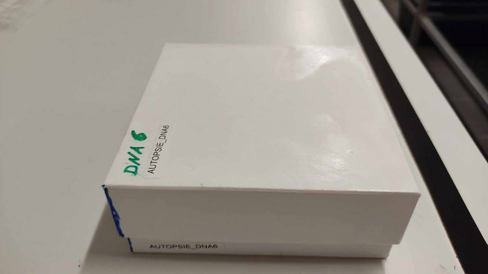
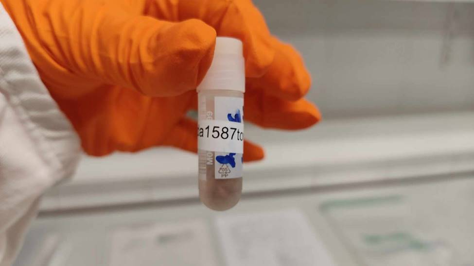

# Stappenplan

## Voorbereiden van de labels

Ter info: dit kan (geruime tijd) op voorhand worden uitgevoerd, voor de snijhandelingen.
Dit wordt uitgevoerd door de *collectie-archivaris*.

1.  De volgende 100 stalen waarvan het weefsel te verkleinen is uit de inventaris worden ingeladen in een nieuwe “doosfile” (zoals bepaald door het sjabloon - zie voorbeeld in [Bijlage D](#bijlage-d)), waarbij een opeenvolgend doosnummer (bv. AUTOPSIE_DNA5) wordt toegekend. Hierbij wordt aandacht besteed aan het aanmaken van een duplicaat van elke spierstaal (hart, tong of spier). Bijvoorbeeld da0123tong1 en da0123tong2 voor de tong van das da0123. Wanneer er twee types spierweefsel zijn bemonsterd: bv. het hart en de tong, wordt voor elk 1 label gemaakt bv. da0123tong1 en da0123hart1.
2.  De 100 unieke codes die op de cryovials moeten hangen, nl. de specimen IDs (bv. da0123tong1, da0123tong2, da0124tong1, da0124tong2, ...), worden samen met een het unieke doosnummer (bv. AUTOPSIE_DNA5) in een eenvoudige spreadsheet gekopieerd waarbij alle te printen labels in kolom A onder elkaar staan. Er is 1 file, en dus 1 printlint per doos.
3.  De spreadsheet met de te printen labels, wordt overgemaakt naar de verantwoordelijke om de labels te printen (bv. zoals beschreven in SIP203-B1).

## Voorbereiden dozen en cryovials

Ter info: dit kan (geruime tijd) op voorhand worden uitgevoerd, voor de snijhandelingen.

1.  Alle werkoppervlakken worden grondig gereinigd met Pursept® AF, gevolgd door Norvanol. Hiervoor wordt een papieren doek gebruikt. Na reinigen wordt de papieren doek in het kleine afvalvat gegooid.
2.  De bewaardoos wordt klaargemaakt: de dozen worden dubbel gelabeld. Het onderste deel van de doos wordt aan de linkerwand gelabeld, zodat het label zichtbaar is als de doos is gesloten. Het deksel van de doos wordt gelabeld bovenaan, in de linkerbovenhoek.

```{r}

```

3.  De cryovials worden rondom rond gelabeld met de unieke specimen ID (bv. da0123tong1). De tekst op het label is volledig leesbaar.

```{r}

```

4.  De cryovials worden gevuld tot 1.5 ml met absolute ethanol met behulp van de maatbeker en de pipet.
5.  De cryovials worden op volgorde van linksboven tot rechtsonder geplaatst. De twee duplicaten telkens naast elkaar. Vijf individuen per rij.
6.  Elk specimen (specimen ID) zit op de positie in de bewaardoos, zoals het aangegeven in het ingevulde sjabloon (zie voorbeeld [bijlage D](#bijlage-d)).
7.  De bewaardoos wordt in de -20°C collectiediepvries geplaatst.
8.  Er wordt gelogd wat de positie is van de bewaardoos in de collectiediepvries. Dit gebeurt in samenspraak met, of op instructie van, de *collectie-archivaris*.

## Voorbereiden van de snijhandelingen {#snijhandelingen}

Ter info: [Voorbereiden van de snijhandelingen](#snijhandelingen), [Monstervoorbehandeling](#monstervoorbehandeling), [Nemen van de substaal](#substaal) en [Concluderen van de werksessie](#werksessie), dienen opeenvolgend (dezelfde werkdag) te worden uitgevoerd.

1.  Alle werkoppervlakken worden grondig gereinigd met Pursept® AF, gevolgd door Norvanol. Hiervoor wordt een papieren doek gebruikt. Na reinigen wordt de papieren doek in het kleine afvalvat gegooid.
2.  De eerste maatbeker wordt met absolute ethanol gevuld om het materiaal te ontsmetten tussen twee specimens.
3.  De tweede maatbeker wordt met absolute ethanol gevuld om de cryovials nog bij te vullen, indien nodig. Plaats deze verder weg van de werktafel en plaats de pipet er in om duidelijk visueel verschil te houden met de ethanol ter ontsmetting.
4.  Het scalpelmesje wordt op de scalpelhouder geplaatst.
5.  De forceps wordt ontsmet in de absolute ethanol. Plaats deze in de maatbeker.

## Monstervoorbehandeling {#monstervoorbehandeling}

Ter info: [Voorbereiden van de snijhandelingen](#snijhandelingen), [Monstervoorbehandeling](#monstervoorbehandeling), [Nemen van de substaal](#substaal) en [Concluderen van de werksessie](#werksessie), dienen opeenvolgend (dezelfde werkdag) te worden uitgevoerd.

1.  Haal uit de bewaardoos: een rij cryovials gevuld met ethanol maar nog geen weefsel (10 stuks) en plaats in het rekje voor de cryovials. Dit betreft 5 kadavers, voor elk twee cryovials (duplicaten). Hierbij aandacht besteden om de cryovials niet open te laten zodat er niet teveel ethanol verdampt. Indien je wenst deze op voorhand al te openen (los te schroeven), kan dit, maar zet de dopjes dan op de cryovials van het specimen waar je NIET mee bezig bent, zodat je niet per ongeluk weefsel met ID X laat vallen de cryovial met ID Y (= contaminatie).
2.  Haal de 5 overeenkomstige diepgevroren spierweefsels van de kadavers met dezelfde kadaver-IDs (zijnde: tongen, harten, stukken beenspier) uit de diepvries. De plaats van de stalen kan teruggevonden worden in de collectie-inventaris. (Vraag hulp aan de *collectie-archivaris* indien je deze collectie-inventaris niet weet zijn).
3.  Breng de 10 cryovials en 5 diepgevroren spierweefsels van de kadavers naar het snijlokaal ter verwerking.
4.  Controleer op het zakje het nummer van de das en het type weefsel of deze overeenkomen met wat er op het label geprint staat. Heb hierbij aandacht dat er soms twee weefsels zijn, bv. hart en tong voor eenzelfde das.

## Nemen van de substaal {#substaal}

Ter info: [Voorbereiden van de snijhandelingen](#snijhandelingen), [Monstervoorbehandeling](#monstervoorbehandeling), [Nemen van de substaal](#substaal) en [Concluderen van de werksessie](#werksessie), dienen opeenvolgend (dezelfde werkdag) te worden uitgevoerd.

1.  Plaats elk van de 5 specimens in een apart zwart bakje ter ontdooien, leg het zakje met het identificatienummer mee in het bakje.
2.  Plaats het diepgevroren spierweefsel van één kadaver (bvb. tong, hart, stuk beenspier) op de grondig gereinigde inox werktafel.
3.  Controleer een laatste maal of het type weefsel dat ontdooid inderdaad tong, hart of een stuk beenspier is zoals genoteerd. Het komt ook soms voor dat twee type weefsels in 1 zakje zitten (bv. hart en tong).
4.  Snij van het bevroren weefsel een stuk buitenlaag weg, zodat je enkel met weefsel overblijft dat niet buitenaan zat (dit kwam mogelijks in aanraking met gecontamineerd bloed en met het plastic van de ziploc zakjes / de zwarte bakjes).
5.  Snij het bevroren weefsel in grove stukken met de scalpel en forceps. Indien het weefsel nog te hard is, even wachten.
6.  Kies het meest roze spierweefsel (niet: zwart of bruin).
7.  Snij een 10-tal kleine blokjes (ongeveer 0.5 cm²) spierweefsel van het geselecteerde roze spierweefsel.
8.  Vul mbv de forceps de twee cryovials met hetzelfde ID nummer (bv da1234) als het kadaver elk met een vijftal blokjes spierweefsel. De cryovial zou op het einde een verhouding van 1/6 weefsel tot 5/6 ethanol moeten hebben. Let op dat je niet teveel weefsel in een cryovial steekt, dat verdunt de ethanol en het vrijgekomen water laat het DNA in de staal degraderen. Vul eventueel nog aan met absolute ethanol indien de cryovial niet vol is.
9.  Sluit de cryovials stevig en plaats ze terug in het rekje.
10. Deponeer het overschot diepgevroren spierweefsel en het vorige opslagvat (bv. potje of zakje) in de kleine afvalcontainer.
11. Reinig het snijoppervlak met Pursept® AF, gevolgd door Norvanol. Hiervoor wordt een papieren doek gebruikt. Na reinigen wordt de papieren doek in het kleine afvalvat gegooid.
12. De scalpel, pincet en handen (met handschoenen) worden afgespoeld met water onder de kraan.
13. De scalpel en pincet worden geplaatst in de maatbeker met absolute ethanol ter ontsmetting. De scalpel en pincet mogen bewogen worden in de ethanol zodat alle weefselrestanten loslaten.
14. De handschoenen worden met Pursept® AF ontsmet.
15. Herhaal tot de vijf diepgevroren spierstalen (bvb. tongen, harten, stukken beenspier) zijn verwerkt tot de 10 cryovials. TIP: indien je nog een reeks van 10 cryovials zal doen, kan je ongeveer 10-15 minuten voor de start van de volgende reeks spierweefsel van de vijf individuen uitleggen ter ontdooien.
16. Plaats de 10 gevulde cryovials terug in de bewaardoos in de collectiediepvries. Spoel de vijf zwarte bakken met water. Reinig de bakjes met Pursept® AF, gevolgd door Norvanol. Hiervoor wordt een papieren doek gebruikt. Na reinigen wordt de papieren doek in het kleine afvalvat gegooid.
17. Herhaal de handeling “Monstervoorbehandeling” en “Nemen van de substaal” naargelang wens. Reinig telkens de werktafel grondig met Pursept® AF, gevolgd door Norvanol. Ten alle tijde wil je contaminatie van de stalen voorkomen. Ga naar “Concluderen van de werksessie” bij einde.

## Concluderen van de werksessie {werksessie}

Ter info: [Voorbereiden van de snijhandelingen](#snijhandelingen), [Monstervoorbehandeling](#monstervoorbehandeling), [Nemen van de substaal](#substaal) en [Concluderen van de werksessie](#werksessie), dienen opeenvolgend (dezelfde werkdag) te worden uitgevoerd.

1.  Plaats de bewaardoos (of indien van toepassing: bewaardozen) met de nieuw gecreëerde substalen op de voorziene (en gelogde) plaats in de -20°C collectie diepvries.
2.  Alle werkoppervlakken worden grondig gereinigd met Pursept® AF, gevolgd door Norvanol. Hiervoor wordt een papieren doek gebruikt. Na reinigen wordt de papieren doek in het kleine afvalvat gegooid.
3.  Al het gecontamineerde afval wordt in de juiste containers geleegd.
4.  Alle materialen (forceps, scalpel, zwarte doosjes ..) worden teruggeplaatst op de voorziene plaatsen.
5.  De gecontamineerde labojassen worden op de juiste plaats gelegd.
6.  Er wordt gelogd welke stalen werden behandeld aan de *collectie-archivaris*. Indien er problemen waren (bv. een staal niet gevonden, een fout label, ..) worden deze gerapporteerd zodat de collectie-inventaris correct wordt bijgehouden, er nieuwe labels worden geprint, … voor de volgende werksessie.

## Naverwerking

Ter info: dit kan met pauze na de snijhandelingen worden uitgevoerd.
Er wordt aangeraden dit zo snel mogelijk uit te voeren.
Dit wordt uitgevoerd door de *collectie-archivaris*.

1.  De *collectie-archivaris* zorgt dat in de collectie-inventaris wordt aangeduid welke weefselstalen (bv. volledige tong, hart, ..) werden verwerkt tot cryovials (substalen, gestandaardiseerd volume).
2.  De *collectie-archivaris* controleert of informatie in de file van de bewaardoos compleet en correct is.
3.  De gemelde problemen worden gelogd. Het oplossen van de problemen gebeurd bij een volgende gelegenheid (bv. herhalen van de procedure), afhankelijk van het specifieke probleem.

```{=html}
<!--
Stap voor stap uitgeschreven tekst (inclusief aspecten van kwaliteitsbewaking
die eventueel in aparte protocollen staan uitgelegd).
Best ook om visuele hulpmiddelen zoals foto's en diagrammen te gebruiken.
-->
```
