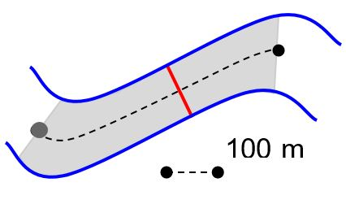
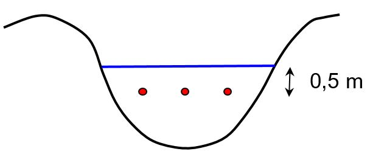

# Overkoepelende werkwijze met verwijzing naar subprotocols

Hieronder een samenvattende opsomming van de te volgen stappen:

1.  Controleer de lijst met benodigdheden en het niveau van de batterijen voor vertrek;

2.  Navigeer met een GPS naar de staalnamelocatie, beoordeel de situatie ter plekke (voor omstandigheden waarin geen staal genomen kan worden zie "3.3 Beperkingen tot de procedure");

3.  Kies een geschikt staalnamepunt en documenteer deze (met foto’s);

4.  Bepaal de secchi- en waterdiepte volgens het protocol [sfp-113-nl 2023.04](../2023.04/index.html);

5.  Bepaal de stroomsnelheid (protocol sfp-118 nog op te stellen);

6.  Spoel het materiaal voor met water van het staalnamepunt en neem een mengstaal volgens protocol [sfp-114-nl 2024.03](../2024.03/index.html);

7.  Neem met de maatbeker een substaal van het mengstaal en voer de veldmeting uit volgens het protocol [sfp-115-nl 2024.04](../2024.04/index.html);

8.  Vul en bewaar de recipiënten voor het laboratorium volgens het protocol [sfp-114-nl 2024.03](../2024.03/index.html) met het overige mengstaal;

9.  Reinig het gebruikte materiaal;

10. Controleer of het staalnameformulier (zie [PDF](./media/Veldformulier_water.pdf)) volledig is ingevuld, voeg eventuele uitzonderlijke veldwaarnemingen toe;

11. Breng de stalen en een kopie van het staalnameformulier binnen bij het labo (binnen 24u na het nemen van het eerste staal);

12. Digitaliseer het staalnameformulier en klasseer de foto’s.

## Voorbereiding terreinwerk

Vooraf worden de geografische coördinaten van de staalnamelocatie ingevoerd in een standaard GPS of in een smartphone-applicatie.
Dit is het meest stroomafwaarts gelegen punt van het te bemonsteren 100 meter segment van de waterloop, de steekproefeenheid voor het project Meetnetten Natuurlijk Milieu.

In juni-september, tijdens een veldbezoek voorafgaand aan de meetcampagne, wordt vastgesteld of het doelhabitat (habitattype 3260) aanwezig is in het waterloopsegment (habitatdefinitie: zie Leyssen et al. 2020 en [sfp-403-nl 2023.05](../2023.05/index.html)).

## Lokaliseren en documenteren van staalnamepunt

Navigeer met behulp van een standaard mobiele GPS-ontvanger (nauwkeurigheid ca. 3-5 m) naar de oever van de staalnamelocatie.

Zoek binnen een afstand van 100m stroomopwaarts naar een geschikt staalnamepunt en documenteer deze bij een eerste staalnamebezoek (coördinaten met standaard GPS, beschrijving en foto).

Meanders worden hierbij best vermeden.

Slibophoping in de binnenbocht die kan opwarrelen, grote diepte in buitenbocht (veiligheid) en bijzondere stromings- en turbulentiepatronen in de meanders die kunnen leiden tot kwaliteitsverschillen in de genomen stalen.

De voorkeur gaat dan uit naar een staalnamepunt gelegen tussen 2 opeenvolgende meanders op maximaal 100m van de oorspronkelijke coördinaten waarmee de staalnamelocatie is aangeduid (figuur \@ref(fig:Figuur1)).
De voorkeur wordt gegeven aan vegetatieloze of vegetatiearme zones in de waterloop.
Verstoring van de planten leidt tot resuspensie van hierop aanwezig sediment, neerslag en aangroei en kan het staal contamineren.

Indien er voorafgaand aan het veldbezoek reeds een staalnamepunt is gedocumenteerd wordt er naar het gedocumenteerde staalnamepunt genavigeerd.

```{r Figuur1, fig.cap="Schematische voorstelling van het meest stroomafwaarts gelegen punt dat de staalnamelocatie aanduidt (grijze bol), de zoekzone voor een geschikt staalnamepunt (grijze zone) en het gekozen staalnamepunt (rode lijn), gelegen tussen opeenvolgende meanders en op niet meer dan 100m van de aanduiding van de staalnamelocatie."}

```

## Secchi-diepte bepalen

Zie deelprotocol ([sfp-113-nl 2023.04](../2023.04/index.html))

De secchi-diepte wordt bij voorkeur bepaald in een vegetatieloze of vegetatiearme zone en in het midden van de waterloop.
Indien de secchi-schijf door te sterke stroming niet loodrecht naar beneden kan worden gelaten, kan ze verzwaard worden door middel van gewichten die onderaan de secchi-schijf bevestigd worden.

Indien de waterdiepte te groot is om de secchi-diepte al wadend te bepalen kan dit vanop een nabijgelegen brug of een verankerde boot gebeuren.

Dit dient gedocumenteerd te worden op het staalnameformulier in het opmerkingenveld.
De waterdiepte waar de secchi-diepte werd bepaald, wordt eveneens genoteerd.

## Bepaling stroomsnelheid

Deelprotocol sfp-118 (nog te ontwikkelen)

De stroomsnelheid wordt op één plaats gemeten voor een algemene kwantitatieve karakterisatie van de stroomsnelheid.
Gedetailleerde stroomsnelheidsbepalingen in verschillende segmenten in de dwarsdoorsnede van de waterlopen en op verschillende diepten zijn hier niet vereist.

De stroomsnelheid wordt gemeten op dezelfde plaats als de secchi-bepaling.
Kies een nagenoeg recht stuk van de waterloop uit, met min of meer horizontale stroming (parallel met oeverlijn).
Submerse vegetatie, grote stenen, vistrappen en andere obstakels moeten vermeden worden omdat deze turbulentie veroorzaken.

De keuze van waterdiepte voor de stroomsnelheidsbepaling dient bij het ontwikkelen van het deelprotocol sfp-118 verder uitgewerkt te worden, o.a.
gebaseerd op Hartong & Termes (2009), Osté et al. (2013), Stone et al. (2012) en WVDEP (2018).

Er zijn verschillende mogelijkheden:

-   De meting gebeurt op de helft van de waterdiepte.
    Bijv: bij een waterdiepte van 1 m, wordt de meting op 0,5 m diepte uitgevoerd.

-   Bij zeer diepe waterlopen wordt de stroomsnelheidsmeting op ca.
    1 m diepte uitgevoerd, omdat de sonde niet dieper geplaatst kan worden (en uit veiligheidsoverwegingen).

-   De meting gebeurt steeds op 0,5 m diepte (vanaf het wateroppervlak gemeten), tenzij de waterloop minder dan 1 m diep is.
    Dan wordt de meting uitgevoerd op de helft van de waterdiepte.

## Bemonstering waterkolom en het vullen van de recipiënten

Zie deelprotocol [sfp-114-nl 2024.03](../2024.03/index.html)

Het mengstaal bestaat uit 3 deelstalen die genomen worden langs het dwarsprofiel van de waterloop ter hoogte van het gekozen staalnamepunt (figuur \@ref(fig:Figuur1)).

Indien de waterloop 1m diep is of meer, worden de deelstalen genomen op 0,5m waterdiepte (figuur \@ref(fig:Figuur2)).
Indien de waterbodem werd omgewoeld bij de bepaling van secchi-diepte of stroomsnelheid, wordt bij geringe stroming een meter stroomopwaarts gewaad voor deze staalname.
Bij de staalname moet vermeden worden om waterbodem mee te bemonsteren, of om te woelen.
Het staal wordt indien mogelijk genomen in een vegetatieloze of vegetatiearme zone en niet tussen helofyten.
Verstoring van de planten leidt tot resuspensie van hierop aanwezig sediment, neerslag en aangroei en kan het staal contamineren.
Desgevallend dient dit bij de opmerkingen op het staalnameformulier vermeld te worden (zie verder).

```{r Figuur2, fig.cap="Situering deelstalen (rode stippen in een dwarsprofiel van een waterloop."}

```

Om de deelstalen te kunnen nemen in stromend water op een diepte van 0,5 meter, zijn volgende methoden of materiaal aangewezen (in dalende voorkeur):

-   Horizontale waterhapper (type Friedinger, Van Dorn, …; zie bijlage 10 van Osté et al. 2013): het staal wordt al wadend genomen in de waterloop; eventueel verzwaard indien de waterstroming te sterk is

-   Maatbeker (inhoud 2 l): het staal wordt met een maatbeker genomen al wadend in de waterloop.
    Hierbij keer je de maatbeker om, laat je deze in het water zakken tot ongeveer 50 cm diepte.
    Vervolgens keer je de maatbeker om, zodat je op deze diepte een staal kan nemen.

-   Horizontale waterhapper vanop een brug: het staal wordt vanop een brug genomen op de 3 deellocaties van de dwarssectie.
    Dit wordt toegepast bij grote waterlopen, waar een brug aanwezig is en indien de waterdiepte te groot is om er door te waden en stalen te nemen.
    Omwoelen van de waterbodem tijdens de staalname dient vermeden te worden.

-   Stok-methode (naar VMM 2020 en bijlage 10 van Osté et al. 2013): Indien de waterdiepte niet toelaat om veilig een staal al wadend te nemen kunnen de deelstalen genomen worden met behulp van een maatbeker of fles, bevestigd aan een (telescopische) stok.
    Indien mogelijk wordt geschept op de 3 plaatsen van de dwarssectie en wordt het staal voorzichtig verzameld in de emmer waarbij er gelet wordt op een minimale zuurstofinbreng.

De staalnamemethode wordt genoteerd op het veldformulier.

## Uitvoering veldmetingen

Zie deelprotocol [sfp-115-nl 2024.04](../2024.04/index.html)

## Aflevering stalen aan het labo

De gekoeld getransporteerde stalen, inclusief een kopie van het staalnameformulier, worden zo snel mogelijk en zeker binnen de tijdspanne van 24 uur na het nemen van het eerste staal van de dag binnengebracht bij het labo.
In het labo worden de stalen, in afwachting van verdere analyse, in de koelkamer bewaard (zie protocol [SOP-007](https://drive.google.com/file/d/1VBRnXKw6SDktn_OWC-ZOO8XXXnHmk5g-/view): Ontvangst en beheer van watermonsters door het laboratorium).

## Digitalisatie van de gegevens op het staalnameformulier

Indien het staalnameformulier op papier werd ingevuld, worden na de staalname de gegevens ingevoerd in het digitale staalnameformulier gedeeld door het labo via Google Drive.

## Registratie en bewaring van resultaten

### Registratie van resultaten: staalnameformulier (naar VMM 2020)

Het staalnameformulier (zie [PDF](./media/Veldformulier_water.pdf)) kan ingedeeld worden in 3 onderdelen:

1.  **Kopgegevens:** labocode (vooraf ingevuld), code staalnamepunt, staalnemer, datum, uur

    -   Reden geen staalname: geen habitattype aanwezig; werken waterloop; staalnamepunt onbereikbaar; onvoldoende watervoerend/-houdend; ijsvorming (omschrijving: zie hoger)

    -   Staalnamepunt: coördinaten, beschrijving, foto-codes, in waterloop (afgekort WL); vanop brug/duiker; vanop steiger

    -   Staalnamemethode: horizontale waterhapper; maatbeker; telescopische stok

    -   Weersomstandigheden: hevige neerslag, geen neerslag, …

    De staalnamepunt en staalnamemethode wordt genoteerd zodat toekomstige staalnames zoveel mogelijk op dezelfde wijze gebeuren en de meetresultaten vergelijkbaar zijn.

2.  **Veldmetingen:** temperatuur (T-veld in°C), zuurtegraad (pH-veld), geleidend vermogen (EC-veld in µS/cm), saliniteit (in g/kg), zuurstofconcentratie (O2-veld in mg/L), zuurstofsaturatie (als % O2), Secchi-diepte (SD in m), waterdiepte (WD in m), stroomsnelheid (ss in m/s)

3.  **Uitzonderlijke omstandigheden:**

    Deze veldwaarnemingen omvatten waarnemingen ter plaatse, of in de onmiddellijke omgeving van het staalnamepunt, van tijdelijke fenomenen waarvoor een verband met de abiotische toestand van de onderzochte waterloop vermoed kan worden.
    Het gaat om vaststellingen die afwijkend zijn van de normale omstandigheden.
    Omdat deze mede de analyseresultaten kunnen verklaren is het van belang dat ze zo uniform mogelijk en kwaliteitsvol worden ingevuld.
    Op het staalnameformulier wordt bij veldwaarnemingen onderstaande onderlijnde uitspraak genoteerd bij ‘uitzonderlijke veldwaarnemingen’.
    Onderstaande lijst kan op een klembord gekleefd worden als geheugensteun:

    -   Zichtbare verontreiniging van wateroppervlak of waterkolom:

        -   [Maaisel]{.underline} / drijvende plantenresten: op het wateroppervlak drijft er maaisel of zijn er drijvende plantenresten aanwezig.
        -   [Dode fauna]{.underline}: dode fauna aanwezig (vis, eend, ...).
        -   [Olie]{.underline}: kleurige film (kleurschakering met rood, paars, blauw en geel) op het wateroppervlak. Opgelet: bacteriën kunnen eveneens een dunne film op het water vormen. Bij verstoring van deze film (bv door de inworp van een steen) zal deze laag echter breken in de vorm van barstjes, terwijl een oliefilm zich bijna onmiddellijk terug sluit.
        -   Vast [afval]{.underline}: zoals bv. flessen, banden, fietsen, plastic zakken, blikjes,...
        -   [Schuim]{.underline}: schuimvorming ten gevolge van algenbloei of tensio-actief schuim (veroorzaakt door detergenten).
        -   [Algenbloei]{.underline}: het water heeft meestal een groene kleur, in de duidelijkste gevallen te omschrijven als ‘erwtensoep’; kan ook gepaard gaan met bv. een bruine, blauwe, paarse of rode kleur.
        -   [Bloei watervlooien]{.underline}: dit kan het water rood kleuren. Het waterstaal bevat veel zoöplankton als men ziet dat de rode massa kleine beweeglijke organismen zijn.
        -   [Gasontwikkeling]{.underline}: aan het wateroppervlak ziet men kleine blaasjes (gasbellen) die openbarsten.
        -   [Vlokken]{.underline}: samengekoekt materiaal (groot of klein) met onregelmatige structuur in of op de waterkolom (meestal wit, grijs of zwart).
        -   [Rioolschimmel]{.underline}: grijze tot bruine slierten (schimmels) op wortels, stenen of de bodem.

    -   Abundante plantengroei, waardoor de staalname bemoeilijkt wordt.

    -   Andere opmerkingen: wordt ingevuld indien geen van de overige codes van toepassing is.

### Bewaring van resultaten

-   Voor elk staalnamepunt wordt ter plaatse een analoog staalnameformulier ingevuld (zie hoger), tenzij er een digitaal formulier (specifiek voor de Meetnetten Natuurlijk Milieu) ter beschikking is (in voorbereiding).
    Afwijkingen van de beschreven werkwijze voor het nemen van een schepstaal worden eveneens genoteerd.

-   De meetresultaten, vermeld op het staalnameformulier, worden zo snel mogelijk gedigitaliseerd en gedeeld met het labo.

-   De laboresultaten worden geregistreerd in LIMS en worden ontsloten via het LIMS-datawarehouse.

### Opslag van foto's

Opslag van foto’s op google drive met aanduiding van opnamedatum, code staalnamelocatie en -punt en naam waterloop (volgens de Vlaamse Hydrografische Atlas; <https://www.vmm.be/data/vlaamse-hydrografische-atlas>).
