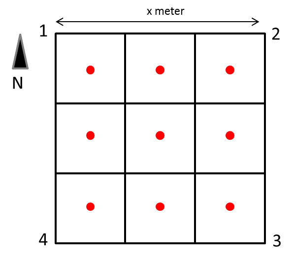

# Werkwijze

## Uitvoering

<!--
Gedetailleerde omschrijving van alle stappen die doorlopen moeten worden om het protocol uit te voeren.
Subtitels gebruiken om elke stap te omschrijven.
-->

In elk kwadrant van het proefvlak worden de monsters manueel genomen met een
gutsboor. Het overtollig bodemmateriaal wordt verwijderd van de boor en
verzameld in het afvalemmertje om na de bemonstering de boorgaten opnieuw te
vullen. De verschillende deelmonsters (één per kwadrant) worden ontdaan van
bodemvreemd materiaal en samengebracht in het mengemmertje om een mengmonster te
maken. Het gehomogeniseerd mengmonster wordt overgebracht in een laboratorium
recipiënt, getransporteerd en bewaard volgens de voorschriften tot verdere
behandeling.

### Bemonsteringsstrategie

#### Uitzetten van het bemonsterinsproefvlak

De staalname van de oppervlaktemonsters gebeurt in vierkante proefvlakken.
Afmetingen zijn gespecifieerd in bijlage 1 aan dit protocol. Het hoekpunt dat
het meest naar het noorden gericht is, krijgt het volgnummer 1. Plaats hier een
eerste bamboestokje. Meet de zijde af in oostelijke richting. Plaats een tweede
bamboestokje. Meet de zijde af in zuidelijke richting, loodrecht op de eerste
zijde. Plaats een derde bamboestokje. Controleer de lengte van die diagonaal en
corrigeer de plaats van het derde bamboestokje. Plaats het vierde bamboestokje
westelijk van het derde en zuidelijk van het eerste bamboestokje. Controleer de
afstanden en corrigeer de plaatsing van de bamboestokjes indien nodig.

#### Aantal deelmonsters

De oppervlakte van het proefvlak wordt opgedeeld in gelijke vierkanten
(zie voorbeeld in figuur 1 waar 9 gelijke vierkanten worden onderscheiden). In
elk van die vierkanten wordt één deelmonster zo centraal mogelijk genomen. Om
voldoende staal te verzekeren zodat de meest courante bodemanalyses kunnen
uitgevoerd worden, wordt bij een keuze van 9 deelmonsters en een
bemonsteringsdiepte van 10 cm, best een guts van 25 mm diameter gebruikt (1
steek met de guts = 1 deelmonster). Het verminderen van het aantal steken bij
het gebruik van een guts met een grotere diameter is niet toegelaten omdat dit
de representativiteit van het mengmonster verkleint.

{width="3.26415135608049in"
height="2.9298501749781276in"}

**Figuur 1:** Schematische weergave van de oriëntatie en spreiding van de
deelmonsters (rode punten) over het proefvlak

#### Bemonsteringsdiepte

De oppervlaktestalen betreffen bodemmonsters standaard genomen op diepte van 0
-- 10 cm onder het bodemoppervlak. Dit protocol kan op analoge wijze toegepast
worden op diepte van 0 -- 20 cm of 0 -- 30 cm.

### Praktische werkwijze voor het nemen van één deelmonster

- Breng de guts handmatig zo verticaal mogelijk in de grond zonder de guts
    daarbij te draaien. Bij harde bodem gebruik je een guts met slagkop (zie
    Figuur \@ref(fig:werkwijze-guts)) zodat je de guts met een terugslagvrije
    hamer (Figuren \@ref(fig:gutsboren) en \@ref(fig:werkwijze-guts)) dieper de
    grond kan inhameren. Zo wordt de holle buis van de guts gevuld met
    bodemmateriaal.


(ref:werkwijze-guts) **Links:** Gebruik van een guts met slagkop *©Eijkelkamp* **Rechts:** Afsnijden van het bodemmateriaal langs de gutsboorranden *©Eijkelkamp*

  
  ```{r werkwijze-guts, fig.cap = "(ref:werkwijze-guts)", fig.show = "hold", out.width = "50%", fig.align = "default"}
  include_graphics(
    path = c("./media/image4.png", 
             "./media/image5.png"))
  ```


- Vervolgens draai je de guts éénmaal om zijn as waardoor het bodemmonster wordt
'losgesneden'. Let op dat je de guts niet dieper de grond induwt.

- Trek vervolgens de guts zachtjes met een draaibeweging uit de grond. Het
draaien zorgt voor minder bodemverlies en werkt de onderdruk tegen die onder de
guts aanwezig is. Zo bekomt men dus een minimaal geroerd monster (foto 3).

  {width="4.304419291338583in"
height="3.2283147419072615in"}

**Foto 3:** Minimaal geroerd bodemmateriaal bij bodembemonstering met een guts ©
*N. Cools*

- Het materiaal in de guts zal aan open zijde van de holle buis steeds wat
materiaal bevatten van de bovenliggende lagen. Dit materiaal wordt verwijderd
met de spatel of een mes en opgevangen in een 'afvalbakje'.

- Vervolgens snijd je met de gebogen spatel de cilindrische kolom bodemmateriaal
af langs de gutsboorranden (zie figuur 3). Het achtergebleven bodemmateriaal is
geschikt voor bemonstering.

- Vervolgens duid je met de spatel het te bemonsteren diepte-interval aan (bvb.
0 -- 10 cm) op het materiaal in de boor door dit lichtjes in te snijden. Dit is
het moment voor het nemen van een foto.

- Vervolgens verwijder je het teveel aan materiaal in het 'afvalemmertje' en
verzamel je het bodemmateriaal uit het gewenste diepte-interval in het
mengemmertje.

- Verwijder alle levende materie (plantendelen zoals knolletjes, bodemdiertjes,
levende wortels,...). Grind en stenen worden handmatig zo goed mogelijk uit het
mengemmertje verwijderd. Herhaal dit voor alle deelmonsters (foto is slechts
noodzakelijk voor één deelmonster).

- **Bereiden van een mengmonster**:

    - Het materiaal wordt in het mengemmertje manueel gemengd en gehomogeniseerd
    met behulp van een spatel.
    De bodemstructuren worden hierbij opgebroken en stenen, levende wortels of
    andere plantendelen worden manueel verwijderd.
    Noot: in een kleiige bodem is dit niet eenvoudig en moet het ganse mengstaal
    in zijn geheel meegenomen worden.
    - Het monster wordt vervolgens overgebracht in het monsterbakje.
    Het eventueel teveel aan bodemmateriaal wordt in het afvalemmertje 
    verzameld.
    Het materiaal uit het afvalemmertje verdeel je over de boorgaten zodat de
    boorgaten terug min of meer afgesloten zijn.


## Registratie en bewaring van resultaten

<!--
Opsomming van alle resultaten die bekomen worden na de uitvoering van het protocol en hoe die resultaten geregistreerd, bewaard of opgeslagen moeten worden.
Voor metingen of observaties: verwijs naar invulformulier (met versienummer; invulformulier toevoegen in bijlage; eventueel bepaalde zaken van invulformulier verduidelijken) en/of naar apparatuur en/of softwareprogramma indien gegevens digitaal worden ingevoerd (verwijs naar sip (standard instrument protocol, <protocol-code>-YYYY.NN) indien beschikbaar; indien geen sip beschikbaar, geef de nodige instructies om gegevens op gepaste wijzen in te kunnen geven).
Voor staalnames: geef aan hoe de stalen bewaard, gelabeld en vervoerd moeten worden.
Geef aan of de stalen voorbehandeld moeten worden.
Voor digitale foto’s en/of andere digitale bestanden: geef aan hoe en waar deze bestanden moeten worden opgeslagen.
Geef eventueel aan welke bestandsnamen aan de bestanden moeten gegeven worden.
-->


### Invullen van het opnameformulier

Per mengmonster wordt het opnameformulier volledig ingevuld en de aan- of
afwezigheid van de relevante kenmerken genoteerd (voorbeeld: zie bijlage 2).

Het opnameformulier wordt, nadat het volledig werd ingevuld met onuitwisbare
inkt, ingescand en digitaal bewaard op een centrale locatie (bvb. Google Drive).
Het papieren formulier wordt overgemaakt aan de verantwoordelijke wetenschapper
die alle opnameformulieren van de survey centraal bewaart. Elke staalnemer voert
de informatie van het opnameformulier digitaal in zoals voorzien binnen het
betreffende onderzoeksproject.

### Nemen van foto's van het bemonsterd proefvlak

Er worden twee foto's van het proefvlak genomen: één voor de bodembemonstering
en één na de bemonstering (waar de bemonsteringspunten in het proefvlak maximaal
zichtbaar zijn). Er wordt tenminste één foto van de boorkern in de guts genomen
(detailfoto). Specifieke kenmerken (zie opnameformulier) worden ook
gefotografeerd.

Op de detailfoto wordt eveneens het ID van het proefvlak en datum van staalname
weergegeven, samen met de schaalaanduiding d.m.v. bv. een vouwmeter. De digitale
foto's worden zo snel mogelijk na de opname hernoemd met naam van het proefvlak
en gefotografeerd kenmerk en op een centrale locatie bvb. Google Drive bewaard.
De volgende principes worden gehanteerd bij de naamgeving van de foto's: de naam
van de foto gaat van algemeen naar specifiek. Een voorbeeldje:

-   De Omgevingsfoto: CODEPROEFVLAK_O
-   De foto van het proefvlak/plot: CODEPROEFVLAK_PLOT
-   De foto van het 0 -- 10 cm staal: CODEPROEFVLAK_M01

### Identificatie (etikettering) van de monsters

De volgende informatie moet minimaal op de recipiënten aanwezig zijn. Bij
voorkeur wordt deze informatie vooraf (indien reeds beschikbaar) op 'heavy duty'
etiketten afgedrukt.

- Plaatsnaam (hoofdgemeente en toponiem)
- Unieke veldidentificatiecode van het proefvlak
- Bemonsteringsdiepte (in dit geval 0-10 cm)
- Datum van bemonstering
- Naam staalnemer

### Transport , bewaring en documentatie van de monsters

Monsters kunnen ten gevolge van fysische, chemische of biologische reacties
wijzigingen ondergaan tussen het ogenblik waarop ze worden genomen en de
analyse. Om dit te voorkomen worden de volgende voorzorgsmaatregelen getroffen:

-   De stalen worden op het terrein in de monsterbakjes gebracht en onmiddellijk
    afgesloten en buiten het bereik van direct zonlicht geplaatst.
-   De stalen worden op terrein voor het transport bewaard in een koelbox met
    koelelementen.
-   De stalen worden dezelfde dag overgebracht naar een koelkast of koelcel (\<
    4°C) totdat de verdere voorbehandeling kan voortgezet worden.

Een **digitale stalenlijst** wordt overgemaakt aan de verantwoordelijke voor de
staalvoorbereiding (drogen en verkleinen). De stalenlijst bevat minimaal de
volgende informatie:

-   Projectnaam of projectcode
-   Naam staalnemer
-   Naam projectverantwoordelijke
-   Datum van bemonstering
-   Plaatsnaam (hoofdgemeente en toponiem)
-   Matrixtype (organisch, mineraal)
-   Veldidentificatiecode van het staal
-   GPS coördinaten (Lambert72 of/en geografische coördinaten WGS84, graden(°),
    > minuten ('), seconden (") of in decimale graden)
